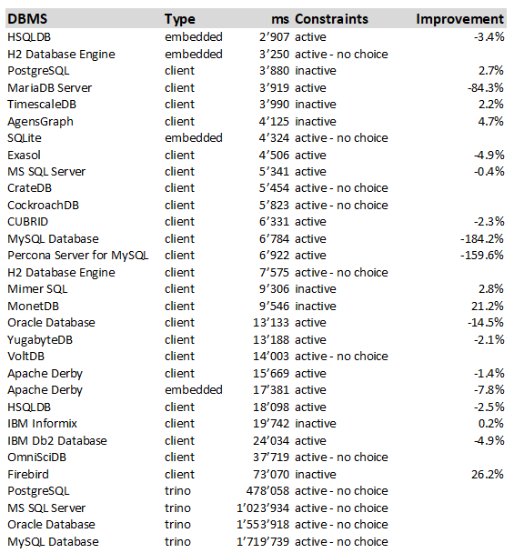

# DBSeeder - Release Notes

----

## Version 3.0.2

Release Date: dd.mm.2021

### System Requirements

- Operating system: any Java-enabled Linux, Mac or Windows variant
- Docker Desktop Community: 3.0.4
- Eclipse IDE: 2021.06 (e.g. from [Eclipse Download Page](https://www.eclipse.org/downloads))
- Gradle Build Tool: 7 (e.g. from [here](https://gradle.org/releases))
- Java Development Kit 15, (e.g. from [here](https://jdk.java.net/java-se-ri/15))
- an environment variable called `HOME_ECLIPSE` that points to the installation directory of Eclipse IDE, e.g.: `C:\Software\eclipse\java-2021-06\eclipse`

### New Features

- n/a

### Modified Features

- Exasol: DBMS 7.1.0-d1
- MariaDB Server: DBMS 10.6.3-focal
- OmniSciDB: DBMS 5.6.4 / JDBC 5.7.0
- xxx: DBMS 999 / JDBC 999

### Deleted Features

- n/a

### Open issues

- CockroachDB: (see [here](#issues_cockroach))
- IBM Db2 Database: (see [here](#issues_ibmdb2))
- OmnisciDB: (see [here](#issues_omnisci))
- trino: (see [here](#issues_trino))
- VoltDB: (see [here](#issues_voltdb))

----

## Windows 10 Performance Snapshot

The finishing touch to the work on a new release is a test run with all databases under identical conditions on three different systems - Ubuntu 20.04 via VMware and WSL2, Windows 10. 
The measured time includes the total time required for the DDL effort (database, schema, user, 5 database tables) and the DML effort (insertion of 7011 rows). 
The hardware used includes an AMD Ryzen 9 5950X CPU with 128GB RAM. 
The tests run exclusively on the computer in each case. 
The detailed results can be found in the DBSeeder repository in the `resources/statistics` directory.

The following table shows the results of the Windows 10 run. 
If the database can run with both activated and deactivated constraints (foreign, primary and unique key), the table shows the better value and in the column `Improvement` the relative value to the worse run. 
For example, the MonetDB database is faster with inactive constraints by 21.2% compared to the run with activated constraints.

- **DBMS** - official DBMS name
- **Type** - client version, embedded version or via trino
- **ms** - total time of DDL and DML operations in milliseconds
- **Constraints** - DML operations with active or inactive constraints (foreign, primary and unique key)
- **Improvment** - improvement of total time if constraints are inactive 

----

## Detailed Open Issues

###  CockroachDB

- Issue: dropping and restoring the same index - SQL statement `DROP INDEX constraint_kxn_2 CASCADE` (see [here](https://github.com/cockroachdb/cockroach/issues/42844)).

###  IBM Db2 Database

- Issue: Docker Image from `docker pull ibmcom/db2:11.5.6.0` (see [here](https://www.tek-tips.com/viewthread.cfm?qid=1811168)).

###  OmniSciDB

- Issue: connection problem with existing OmnisciDB (see [here](https://github.com/omnisci/omniscidb/issues/668)).

###  trino

- Issue: all connectors: absolutely unsatisfactory performance (see [here](https://github.com/trinodb/trino/issues/5681)).
    
- Issue: Oracle connector: Oracle session not disconnected (see [here](https://github.com/trinodb/trino/issues/5648)).
    
- Issue: Oracle connector: Support Oracle's NUMBER data type (see [here](https://github.com/trinodb/trino/issues/2274)).

###  VoltDB

- Issue: Java 16 not yet supported: `java.lang.NullPointerException: Cannot invoke "io.netty_voltpatches.NinjaKeySet.size()" because "this.m_ninjaSelectedKeys" is null`

----------

