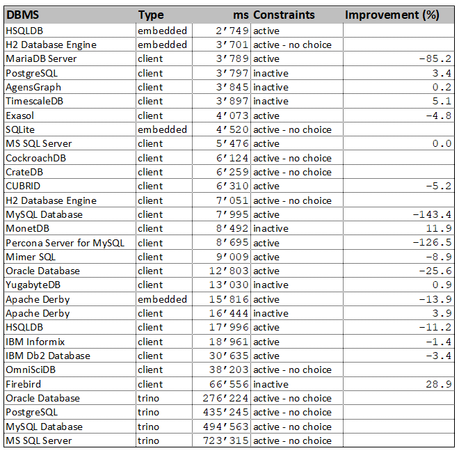

# DBSeeder - Release Notes


----

## Version 3.0.4

Release Date: dd.mm.2021

### System Requirements

- Operating system: any Java-enabled Linux, Mac or Windows variant
- Docker Desktop Community: 4.0.0 (e.g. from [Docker for Windows release notes](https://docs.docker.com/docker-for-windows/release-notes))
- Eclipse IDE: 2021.09 (e.g. from [Eclipse Download Page](https://www.eclipse.org/downloads))
- Gradle Build Tool: 7 (e.g. from [here](https://gradle.org/releases))
- Java Development Kit 17, (e.g. from [here](https://jdk.java.net/java-se-ri/17))
- an environment variable called `HOME_ECLIPSE` that points to the installation directory of Eclipse IDE, e.g.: `C:\Software\eclipse\java-2021-09\eclipse`

### New Features

- n/a

### Modified Features

- AgensGraph: DBMS v2.5.0
- CockroachDB: DBMS v21.1.11
- CrateDB: DBMS 4.6.4
- Exasol: DBMS 7.1.2 / JDBC 7.1.1
- Firebird: JDBC 4.0.4.java11
- IBM Db2 Database: DBMS 11.5.6.0a
- IBM Informix: DBMS 14.10.FC6DE / JDBC 4.50.6
- MonetDB: DBMS Jul2021-SP1
- OmniSciDB: DBMS 5.8.0
- PostgreSQL: DBMS 14.0 / JDBC 42.2.24
- SQL Server: DBMS 2019-CU13-ubuntu-20.04
- TimescaleDB: DBMS 2.4.2-pg13
- trino: DBMS 363 / JDBC 363

### Deleted Features

- n/a

### Open issues

- AgensGraph: (see [here](#issues_agensgraph))
- CockroachDB: (see [here](#issues_cockroach))
- HSQLDB: (see [here](#issues_hsqldb))
- OmnisciDB: (see [here](#issues_omnisci))
- trino: (see [here](#issues_trino))
- VoltDB: (see [here](#issues_voltdb))

----

## Windows 10 Performance Snapshot

The finishing touch to the work on a new release is a test run with all databases under identical conditions on three different systems - Ubuntu 20.04 via VMware and WSL2, Windows 10. 
The measured time includes the total time required for the DDL effort (database, schema, user, 5 database tables) and the DML effort (insertion of 7011 rows). 
The hardware used includes an AMD Ryzen 9 5950X CPU with 128GB RAM. 
The tests run exclusively on the computer in each case. 
The detailed results can be found in the DBSeeder repository in the `resources/statistics` directory.

The following table shows the results of the Windows 10 run. 
If the database can run with both activated and deactivated constraints (foreign, primary and unique key), the table shows the better value and in the column `Improvement` the relative value to the worse run. 
For example, the MonetDB database is faster with inactive constraints by 9.2% compared to the run with activated constraints.



- `DBMS` - official DBMS name
- `Type` - client version, embedded version or via trino
- `ms` - total time of DDL and DML operations in milliseconds
- `Constraints` - DML operations with active or inactive constraints (foreign, primary and unique key)
- `Improvment` - improvement of total time if constraints are inactive 

----

## Detailed Open Issues

### <a name="issues_agensgraph"></a> AgensGraph

- Issue: Database tables not visible in DBeaver.

### <a name="issues_cockroach"></a> CockroachDB

- Issue: dropping and restoring the same index - SQL statement `DROP INDEX constraint_kxn_2 CASCADE` (see [here](https://github.com/cockroachdb/cockroach/issues/42844)).

### <a name="issues_hsqldb"></a> HSQLDB

- Issue: `java.sql.SQLSyntaxErrorException: user lacks privilege or object not found: SYS_IDX_KXN_26_10100` (see [here](https://stackoverflow.com/questions/46362160/error-java-sql-sqlsyntaxerrorexception-user-lacks-privilege-or-object-not-foun)).
```
    2021-09-06 12:03:53,676 [DatabaseSeeder.java] INFO  tickerSymbolAnyCase='hsqldb_emb'
    2021-09-06 12:03:53,676 [DatabaseSeeder.java] INFO  Start HSQLDB [embedded]
    2021-09-06 12:03:53,680 [AbstractDbmsSeeder.java] INFO  tickerSymbolIntern =hsqldb
    2021-09-06 12:03:53,688 [AbstractJdbcSeeder.java] INFO  tickerSymbolExtern =hsqldb_emb
    java.sql.SQLSyntaxErrorException: user lacks privilege or object not found: SYS_IDX_KXN_26_10100
        at org.hsqldb.jdbc.JDBCUtil.sqlException(Unknown Source)
        at org.hsqldb.jdbc.JDBCUtil.sqlException(Unknown Source)
        at org.hsqldb.jdbc.JDBCStatement.fetchResult(Unknown Source)
        at org.hsqldb.jdbc.JDBCStatement.execute(Unknown Source)
        at ch.konnexions.db_seeder.jdbc.AbstractJdbcSeeder.executeSQLStmnts(AbstractJdbcSeeder.java:1351)
        at ch.konnexions.db_seeder.jdbc.AbstractJdbcSeeder.dropTableConstraints(AbstractJdbcSeeder.java:1220)
        at ch.konnexions.db_seeder.jdbc.AbstractJdbcSeeder.createData(AbstractJdbcSeeder.java:420)
        at ch.konnexions.db_seeder.DatabaseSeeder.main(DatabaseSeeder.java:168)
        Caused by: org.hsqldb.HsqlException: user lacks privilege or object not found: SYS_IDX_KXN_26_10100
        at org.hsqldb.error.Error.error(Unknown Source)
        at org.hsqldb.error.Error.error(Unknown Source)
        at org.hsqldb.SchemaManager.getSchemaObject(Unknown Source)
        at org.hsqldb.ParserDQL.readSchemaObjectName(Unknown Source)
        at org.hsqldb.ParserDDL.compileAlterTableDropConstraint(Unknown Source)
        at org.hsqldb.ParserDDL.compileAlterTable(Unknown Source)
        at org.hsqldb.ParserDDL.compileAlter(Unknown Source)
        at org.hsqldb.ParserCommand.compilePart(Unknown Source)
        at org.hsqldb.ParserCommand.compileStatements(Unknown Source)
        at org.hsqldb.Session.executeDirectStatement(Unknown Source)
        at org.hsqldb.Session.execute(Unknown Source)
        ... 6 more`
```

### <a name="issues_omnisci"></a> OmniSciDB

- Issue: connection problem with existing OmnisciDB (see [here](https://github.com/omnisci/omniscidb/issues/668)).

### <a name="issues_trino"></a> trino

- Issue: all connectors: absolutely unsatisfactory performance (see [here](https://github.com/trinodb/trino/issues/5681)).
    
- Issue: Oracle connector: Oracle session not disconnected (see [here](https://github.com/trinodb/trino/issues/5648)).
    
- Issue: Oracle connector: Support Oracle's NUMBER data type (see [here](https://github.com/trinodb/trino/issues/2274)).

### <a name="issues_voltdb"></a> VoltDB

- Issue: Java 16 not yet supported: `java.lang.NullPointerException: Cannot invoke "io.netty_voltpatches.NinjaKeySet.size()" because "this.m_ninjaSelectedKeys" is null`
```
    2021-09-02 03:39:41,112 [DatabaseSeeder.java] INFO  tickerSymbolAnyCase='voltdb'
    2021-09-02 03:39:41,112 [DatabaseSeeder.java] INFO  Start VoltDB
    2021-09-02 03:39:41,117 [AbstractDbmsSeeder.java] INFO  tickerSymbolIntern =voltdb
    2021-09-02 03:39:41,127 [AbstractJdbcSeeder.java] INFO  tickerSymbolExtern =voltdb
    java.lang.NullPointerException: Cannot invoke "io.netty_voltpatches.NinjaKeySet.size()" because "this.m_ninjaSelectedKeys" is null
	    at org.voltcore.network.VoltNetwork.optimizedInvokeCallbacks(VoltNetwork.java:478)
	    at org.voltcore.network.VoltNetwork.run(VoltNetwork.java:329)
	    at java.base/java.lang.Thread.run(Thread.java:831)
    Sept. 02, 2021 3:39:41 AM org.voltcore.logging.VoltUtilLoggingLogger log
    SEVERE: NULL : Throwable: java.lang.NullPointerException: Cannot invoke "io.netty_voltpatches.NinjaKeySet.size()" because "this.m_ninjaSelectedKeys" is null
    java.lang.NullPointerException: Cannot invoke "io.netty_voltpatches.NinjaKeySet.size()" because "this.m_ninjaSelectedKeys" is null
	    at org.voltcore.network.VoltNetwork.optimizedInvokeCallbacks(VoltNetwork.java:478)
	    at org.voltcore.network.VoltNetwork.run(VoltNetwork.java:329)
	    at java.base/java.lang.Thread.run(Thread.java:831)
    Sept. 02, 2021 3:39:41 AM org.voltcore.logging.VoltUtilLoggingLogger log
    SEVERE: NULL : Throwable: java.lang.NullPointerException: Cannot invoke "io.netty_voltpatches.NinjaKeySet.size()" because "this.m_ninjaSelectedKeys" is null
```
    
----------

