# DBSeeder - Relational Database Data Generator.


----

## 1. Introduction

**`DBSeeder`** allows the flexible generation of large amounts of anonymised random dummy data for selected relational database systems (RDBMS) - useful e.g. for stress testing.

The database schema underlying the data generation can be freely defined.
The names of the database, the schema and the user can be freely chosen, unless the respective database management system contains restrictions.
If the selected database, schema or user already exist, they are deleted with all including data.
**`DBSeeder`** then creates the selected database, schema or user and generates the desired dummy data.
A maximum of 2 147 483 647 rows can be generated per database table.
The database schema to be used, that is, the required database tables can be user defined using a JSON file.
Details can be found here: [Database Schema](#database_schema).

Currently, depending on the capabilities of the specific RDBMS, the following functionalities and data types are supported:

- constraints
    - foreign (referential) key
    - not null constraint
    - primary key
    - unique (alternate) key
- data types
    - BIGINT - large integer
    - BLOB - large binary object
    - CLOB - large character Object
    - TIMESTAMP - timestamp including date
    - VARCHAR - variable text

The database systems considered meet the following conditions:

1. The database system is freely available in a documented docker image for testing purposes.
1. The database system provides a well documented JDBC interface.
1. A complete documentation of the SQL commands is available.

[//]: # (===========================================================================================)

### 1.1 RDBMS Overview

| RDBMS                    | Ticker Symbol(s)   | RDBMS Versions            | Latest JDBC    |
|--------------------------|--------------------|---------------------------|----------------|
| AgensGraph               | agens              | v2.1.1 - v2.5.0           | 1.4.2-c1       |
| Apache Derby             | derby, derby_emb   | 10.15.2.0                 | 10.15.2.0      |
| CockroachDB              | cockroach          | v20.2.5 - v21.2.8         | see PostgreSQL |
| CrateDB                  | cratedb            | 4.1.6 - 4.7.1             | 2.6.0          |
| CUBRID                   | cubrid             | 10.2 - 11.0               | 11.0.6.0313    |
| Exasol                   | exasol             | 6.2.8-d1 - 7.1.9          | 7.1.7          |
| Firebird                 | firebird           | 3.0.5 - v4.0.1            | 4.0.5.java11   | 
| H2 Database Engine       | h2, h2_emb         | 1.4.200 - 2.1.212         | 2.1.212        | 
| HeavyDB                  | heavy              | v5.6.1 - v5.10.2          | 5.10.0         |
| HSQLDB                   | hsqldb, hsqldb_emb | 2.5.1 - 2.6.1             | 2.6.1          | 
| IBM Db2 Database         | ibmdb2             | 11.5.1.0 - 11.5.7.0a      | 11.5.7.0       |
| IBM Informix             | informix           | 14.10 FC3DE -             | 4.50.7.1       |
|                          |                    | 14.10.FC7W1DE             |                | 
| MariaDB Server           | mariadb            | 10.4.13 - 10.7.3-focal    | 3.0.4          | 
| Mimer SQL                | mimer              | v11.0.3c - v11.0.5a       | 3.42.3         |
| MonetDB                  | monetdb            | Jun2020-SP1 - Jan2022-SP2 | 3.2.jre8       | 
| MySQL Database           | mysql              | 8.0.20 - 8.0.28           | 8.0.28         | 
| Oracle Database          | oracle             | 12.1.0.2 - 21.3.0         | 21.4.0.0.1     |
| Percona Server for MySQL | percona            | 8.0.27-18                 | see MySQL      | 
| PostgreSQL               | postgresql         | 12.3 - 14.2-alpine        | 42.3.3         |
| SQL Server               | sqlserver          | 2019-CU12-ubuntu-20.04 -  | 9.4.1.jre16    |
|                          |                    | 2019-CU15-ubuntu-20.04    |                | 
| SQLite                   | sqlite             | 3.32.0 - 3.36.0           | 3.36.0.3       |
| TimescaleDB              | timescale          | 2.3.1-pg13 - 2.6.1-pg14   | see PostgreSQL |
| trino                    | mysql_trino,       | 339 - 368                 | 368            |
|                          | oracle_trino,      |                           |                |
|                          | postgresql_trino,  |                           |                |
|                          | sqlserver_trino    |                           |                |
| VoltDB                   | voltdb             | 9.2.1                     | 11.0           |
| YugabyteDB               | yugabyte           | 2.2.2.0-b15 -             | see PostgreSQL |
|                          |                    | 2.13.0.1-b2               |                |

[//]: # (===========================================================================================)

### 1.2 RDBMS Directory

The following database systems are included in the current version of **`DBSeeder`**:

- [AgensGraph](https://bitnine.net/agensgraph){:target="_blank"}
    - client only version
    - commercial, open source
    - derived from PostgreSQL
    - property graph model and relational model
- [Apache Derby](https://db.apache.org/derby){:target="_blank"}
    - client and embedded version
    - open source
    - relational model
- [CockroachDB](https://www.cockroachlabs.com){:target="_blank"}
    - client only version
    - commercial, open source
    - compatible with PostgreSQL JDBC
    - relational model
- [CrateDB](https://crate.io){:target="_blank"}
    - client only version
    - commercial, open source
    - compatible with PostgreSQL
    - relational model
- [CUBRID](https://www.cubrid.org){:target="_blank"}
    - client only version
    - compatible with MySQL
    - open source
    - relational model
- [Exasol](https://www.exasol.com/en){:target="_blank"}
    - client only version
    - commercial
    - in-memory, column-oriented, relational model
- [Firebird](https://firebirdsql.org){:target="_blank"}
    - client and embedded (not supported here) version
    - open source
    - relational model
- [H2 Database Engine](https://www.h2database.com/html/main.html){:target="_blank"}
    - client and embedded version
    - compatible with HSQLDB, PostgreSQL
    - open source
    - relational model
- [HeavyDB](https://www.heavy.ai){:target="_blank"}
  - client only version
  - commercial, open source
  - GPU and CPU version
  - relational model
- [HSQLDB](https://hsqldb.org) 
    - client and embedded version
    - open source
    - relational model
- [IBM Db2 Database](https://www.ibm.com/products/db2-database){:target="_blank"}
    - client only version
    - commercial
    - relational model
- [IBM Informix](https://www.ibm.com/products/informix){:target="_blank"}
    - client only version
    - commercial
    - relational model
- [MariaDB Server](https://mariadb.com){:target="_blank"}
    - client only version
    - open source
    - derived from MySQL
    - relational model
- [Mimer SQL](https://www.mimer.com){:target="_blank"}
    - client only version
    - commercial
    - relational model
- [MonetDB](https://www.monetdb.org){:target="_blank"}
    - client only version
    - open source
    - column-oriented relational model
- [MySQL Database](https://www.mysql.com){:target="_blank"}
    - client only version
    - open source
    - relational model
- [Oracle Database](https://www.oracle.com/database){:target="_blank"}
    - client only version
    - commercial
    - relational model
- [Percona Server for MySQL](https://www.percona.com/software/mysql-database/percona-server){:target="_blank"}
    - client only version
    - commercial, open source
    - derived from MySQL
    - relational model
- [PostgreSQL](https://www.postgresql.org){:target="_blank"}
    - client only version
    - open source
    - relational model
- [SQL Server](https://www.microsoft.com/en-us/sql-server/sql-server-2019){:target="_blank"}
    - client only version
    - commercial
    - derived from Adaptive Server Enterprise
    - relational model
- [SQLite](https://www.sqlite.org)
    - commercial, open source
    - embedded only version
    - relational model
- [TimescaleDB](https://www.timescale.com){:target="_blank"}
    - client only version
    - commercial, open source
    - derived from PostgreSQL
    - relational model
- [trino](https://trino.io){:target="_blank"}
    - compatible with Accumulo, Cassandra, Elasticsearch, Hive, Kudu, MongoDB, MySQL, Pinot, PostgreSQL, Redis, Redshift
    - distributed query engine
    - open source

For the RDBMS MySQL, Oracle, PostgreSQL and SQL Server the JDBC driver from trino can optionally be used instead of the original JDBC driver.
The prerequisite for this is that trino is either installed locally (Linux) or is available as a Docker container (Linux and Windows).
Details can be found here: [trino](#trino).

- [VoltDB](https://www.voltdb.com){:target="_blank"}
    - client only version
    - commercial, open source
    - derived from H-Store, HSQLDB
    - in-memory relational model
- [YugabyteDB](https://www.yugabyte.com){:target="_blank"}
    - client only version
    - commercial, open source
    - compatible with Cassandra, PostgreSQL, Redis
    - derived from PostgreSQL, RocksDB
    - inspired by Cloud Spanner
    - relational model

[//]: # (===========================================================================================)

## 2. Data 

### <a name="database_schema"></a> 2.1 Database Schema

The underlying database schema is defined in a JSON-based parameter file and the associated program code is generated and compiled with the script `scripts/run_db_seeder_generate_schema`.
To validate the database schema in the JSON parameter file, the JSON schema file `db_seeder_schema.schema.json` in the directory `src/main/resources` is used.

#### 2.1.1 Structure of the Database Schema Definition File 

The definition of a database schema consists of the object `global` with the global parameters and the array `tables`, which contains the definition of the database tables.

##### 2.1.1.1 `globals` - Global Parameters

- `defaultNumberOfRows` - default value for the number of table rows to be generated, if no value is specified in the table definition
- `encodingISO_8859_1` - a string with Western Latin characters is inserted into generated character columns
- `encodingUTF_8` - a string with simplified Chinese characters is inserted into generated character columns
 specified in the table definition
- `nullFactor` - determines the proportion of NULL values in optional columns and must be between 2 and 99 (inclusive): 2 means 50%, 4 means 25%, 10 means 10%, etc., default value is 4

##### 2.1.1.2 `tables` - Database Table Definitions

- `tableName` - database table name
- `numberOfRows` - number of table rows to be generated
- `columns` - an array of column definitions
    - `columnName` - column name
    - `dataType` - data type, is one of BIGINT, BLOB, CLOB, TIMESTAMP or VARCHAR
    - `size` - for data type VARCHAR the maximum size of the column value 
    - `precision` - currently not used
    - `notNull` - is a NULL value allowed ?
    - `primaryKey` - is this the primary key column ?
    - `references` - an array of foreign key definitions
        - `referenceTable` - name of the reference database table
        - `referenceColumn` - name of the reference column 
    - `defaultValueInteger` - default value for integer columns
    - `defaultValueString` - default value for alphanumeric columns
    - `lowerRangeInteger` - lower limit for an integer column, requires also an upper limit
    - `lowerRangeString` - lower limit for an alphanumeric column, requires also an upper limit
    - `upperRangeInteger` - upper limit for an integer column
    - `upperRangeString` - upper limit for an alphanumeric column
    - `validValuesInteger` - valid values for an integer column
    - `validValuesString` - valid values for an alphanumeric column
- `tableConstraints` - an array of table constraint definitions
    - `constraintType` - constraint type, is one of FOREIGN, PRIMARY or UNIQUE
    - `columns` - an arry with the names of the affected columns
    - `referenceTable` - name of the reference database table, only for foreign keys
    - `referenceColumns` - an arry with the names of the affected reference columns, only for foreign keys

Only either a range restriction (`lowerRange...`, `upperRange...`) or a value restriction (`validValues...`) may be specified for each column.

#### 2.1.2 Mapping of Data Types in the JDBC Driver 

| Data Type   | JDBC Method                                                |
| ---         | ---                                                        |
| `BIGINT`    | `setLong`                                                  |
| `BLOB`      | `setBytes`                                                 |
| `CLOB`      | `setString`                                                |
| `TIMESTAMP` | `setTimestamp`                                             |
| `VARCHAR`   | `setNString` (Firebird, MariaDB, MS SQL SERVER and Oracle) |
|             | `setString` (else)                                         |

#### 2.1.3 Example File `db_seeder_schema.company_9...9.json` in the Directory `resources/json` 

This file contains the definition of a simple database schema consisting of the database tables CITY, COMPANY, COUNTRY, COUNTRY_STATE and TIMEZONE.  

The abbreviations in the following illustration (created with Toad Data Modeler) mean:

- (AK1) - alternate key (unique key)
- FK    - foreign key
- NN    - not null
- PK    - primary key

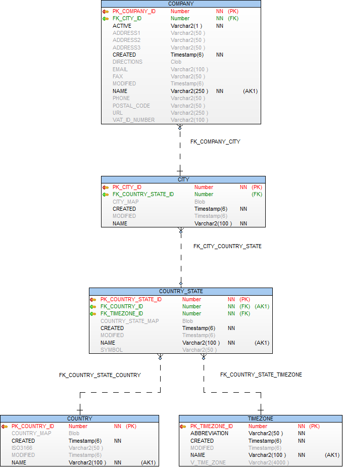

[//]: # (===========================================================================================)

### 2.2 Construction of the Dummy Data Content

The proportion of `NULL` values in optional columns is defined by the global parameter `nullFactor`.

All methods for generating column contents can be overwritten if necessary.

#### 2.2.1 BIGINT 

Java method: `getContentBigint`

- If the column parameter `validValuesInteger` is defined in the database schema, a random value is taken from it. 
- If the column parameters `lowerRangeInteger` and `upperRangeInteger` are defined in the database schema, a random value is taken from this interval. 
- Otherwise the counter for the current row (row number) is used. 

#### 2.2.2 BLOB

Java method: `getContentBlob`

- The content of the file `blob.png` from the resource directory (`src/main/resources`) is loaded into these columns.This file contains the company logo of Konnexions GmBH.

#### 2.2.3 CLOB

Java method: `getContentClob`

- The content of the file `clob.md` from the resource directory (`src/main/resources`) is loaded into these columns. This file contains the text of the Konnexions Public License (KX-PL).

#### 2.2.4 TIMESTAMP

Java method: `getContentTimestamp`

- A randomly generated timestamp is assigned to all columns that can contain temporal data.

#### 2.2.5 VARCHAR

Java method: `getContentVarchar`

- If the column parameter `validValuesString` is defined in the database schema, a random value is taken from it. 
- If the column parameters `lowerRangeString` and `upperRangeString` are defined in the database schema, a random value is taken from this interval. 
- Otherwise content of the column is constructed depending on the row number and the encoding flags as follows:
    - ASCII (all rows where the index modulo 3 is 0):
        - column name in capital letters
        - underscore `_`
        - current row number left-justified
    - ISO 8859 1 (all rows where the index modulo 3 is 1) :
        - column name in capital letters
        - underscore `_`
        - a string containing specific Western European characters with accent (e.g. French, Portuguese or Spanish)
        - underscore `_`
        - current row number left-justified
    - the ISO 8859 1 version can be prevented by choosing `encodingISO_8859_1` `false` in the database schema definition  
    - UTF-8 (all rows where the index modulo 3 is 2):
        - column name in capital letters
        - underscore `_`
        - a string containing simplified Chinese characters
        - underscore `_`
        - current row number left-justified
    - the UTF-8 version can be prevented by choosing `encodingUTF_8` `false` in the database schema definition
    - If the resulting value exceeds the permissible column size, the value is shortened accordingly from the left

#### 2.2.6 Examples

##### 1. Table CITY

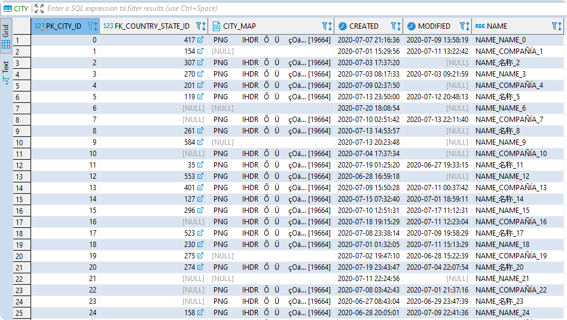

##### 2. Table COUNTRY

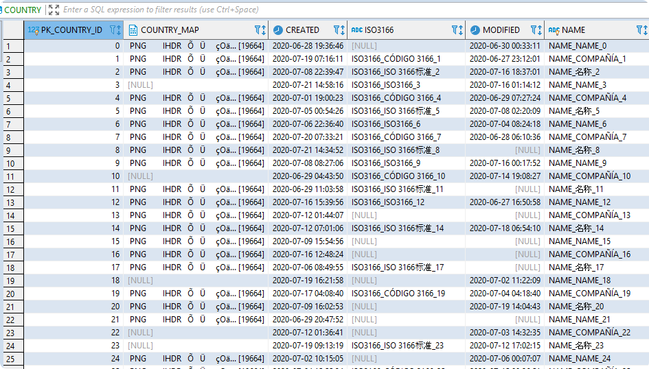

[//]: # (===========================================================================================)

##### 3. Table TIMEZONE

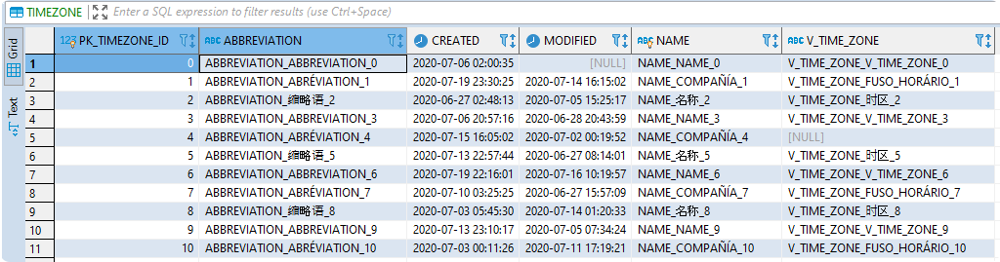

## 3. Installation

The easiest way is to download a current release of **`DBSeeder`** from the GitHub repository.
You can find the necessary link [here](https://github.com/KonnexionsGmbH/db_seeder){:target="_blank"}.

To download the repository [Git](https://git-scm.com){:target="_blank"} is needed and for compilation the [Gradle Build Tool](https://gradle.org){:target="_blank"} and the [open-source JDK](https://openjdk.java.net){:target="_blank"} are needed.
For changes to the **`DBSeeder`** repository it is best to use an editor (e.g. [Vim](https://www.vim.org){:target="_blank"}) or an IDE (e.g. [Eclipse IDE](https://www.eclipse.org){:target="_blank"}).
For using the Docker Image based databases in operational mode, [Docker Desktop](https://www.docker.com/products/docker-desktop){:target="_blank"} must also be installed.
For the respective software versions, please consult the document [release notes](release-notes.md){:target="_blank"}.

[//]: # (===========================================================================================)

## 4. Operating Instructions 

### 4.1 Script `run_db_seeder`

Using the **`DBSeeder`** development and operational Docker image from Docker Hub (see [here](https://hub.docker.com/repository/docker/konnexionsgmbh/db_seeder){:target="_blank"}) eliminates the need to install the runtime environment.
 
With the script `run_db_seeder` the complete functionality of the **`DBSeeder`** application can be used:

- Creating a suitable database
- Generation of any number of dummy data.

All scripts are available in a Windows version (`cmd` / `.bat`) as well as in a Unix version (`bash` / `.sh`). 
To run the scripts, apart from the prerequisites as release notes (`ReleaseNotes.md`), 
only the libraries in the `lib` directory and the corresponding script of `run_db_seeder` are required. 
The creation of the databases also requires a working access to [Docker Hub](https://hub.docker.com).
 
All control parameters used in **`DBSeeder`** (see section 4.3) can be adapted in the scripts to specific needs.

The `run_db_seeder` script is controlled by the following script parameters:: 

- `DB_SEEDER_DBMS`: the ticker symbol of the desired database management system (default value `sqlite`) or `complete` for all implemented RDBMS.
- `DB_SEEDER_SETUP_DBMS`: should an empty database be created:
    - `yes`: a new database is created based on a suitable Docker image
    - otherwise: no database is created 
- `DB_SEEDER_NO_CREATE_RUNS`: Number of dummy data generation runs:
    - 1: one run
    - 2: two runs
    - otherwise: no run

For the run variants `complete`, `complete_client`, `complete_emb` and `complete_trino`, statistics files with the following data name structure are created in the file directory `resources/statistics` by default:

    db_seeder_<bash|cmd>_<run variant>_unknown_<DBSeeder release>_<vmware|win10|wsl2>.<csv|tsv>

An overview of the structure of the scripts used can be taken from the following diagram:


[//]: # (===========================================================================================)

### 4.2 Operation Possibilities

**`DBSeeder`** is tested under [Ubuntu](https://ubuntu.com) and [Microsoft Windows](https://en.wikipedia.org/wiki/Microsoft_Windows).
In addition, tests are always performed in Windows with Ubuntu under the [Windows Subsystem for Linux (WSL)](https://docs.microsoft.com/en-us/windows/wsl).
Besides one of the two operating systems, these are the minimum requirements for running **`DBSeeder`**:

- [Docker Desktop Community](https://www.docker.com/products/docker-desktop)
- [Eclipse IDE](https://www.eclipse.org)
- [Gradle Build Tool](https://gradle.org)
- [Java Development Kit](https://en.wikipedia.org/wiki/Java_Development_Kit)

Details on the required software versions can be found in the [release notes](release-notes.md).

#### Special Features for the Operation with Ubuntu

- A suitable image is available on Docker Hub for development and operation, see [here](https://hub.docker.com/repository/docker/konnexionsgmbh/db_seeder).

- In the directory `scripts/3.0.6` are the two scripts `run_install_4_vm_wsl2_1.sh` and `run_install_4_vm_wsl2_1.sh` with which an Ubuntu environment can be prepared for development and operation.

- If the Windows Subsystem for Linux (WSL) is to be used, then the `WSL INTEGRATION` for Ubuntu must be activated in Docker

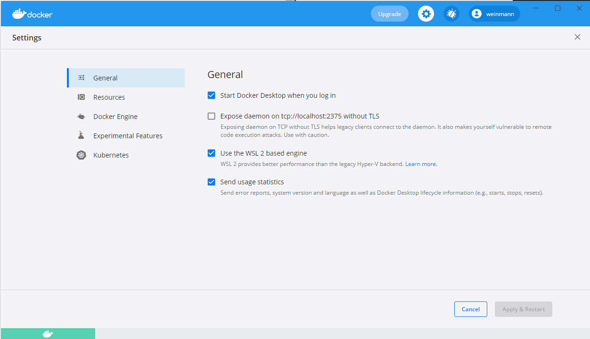


### 4.3 Control Parameters
 
#### 4.3.1 Supported Parameters

The flow control parameters for **`DBSeeder`** are stored in the properties file `src/main/resources/db_seeder.properties` and can all be overridden by the environment variables defined in the scripts.
The following control parameters are currently supported:

```
db_seeder.batch.size=0
db_seeder.character.set.server=
db_seeder.collation.server=
db_seeder.connection.host=
db_seeder.connection.host.trino=
db_seeder.connection.port=0
db_seeder.connection.port.trino=0
db_seeder.connection.prefix=
db_seeder.connection.service=
db_seeder.connection.suffix=

db_seeder.database.sys=
db_seeder.database=
db_seeder.drop.constraints=

db_seeder.file.configuration.name=yes
db_seeder.file.improvement.header=DBMS;Type;ms;Constraints;Improvement
db_seeder.file.improvement.name=
db_seeder.file.json.name=resources/json/db_seeder_schema.company_5400.json
db_seeder.file.statistics.delimiter=\t
db_seeder.file.statistics.header=ticker symbol;DBMS;db type;total ms;start time;end time;host name;no. cores;operating system;total DDL ms;drop constr. ms;add constr. ms;total DML ms;constraints
db_seeder.file.statistics.name=resources/statistics/db_seeder_statistics.tsv
db_seeder.file.summary.name=
db_seeder.file.summary.source=resources/statistics

db_seeder.password.sys=
db_seeder.password=

db_seeder.schema=

db_seeder.user.sys=
db_seeder.user=
```

#### 4.3.2 Explanation and Cross-reference

| Property incl. Default Value [db.seeder.] | Environment Variable [DB_SEEDER_] | Used By                                                                           | Description |     
| ---                                       | ---                               |-----------------------------------------------------------------------------------| --- |
| batch.size=<9...9>                        | BATCH_SIZE                        | all RDBMS except                                                                  | number of insert operations for the bulk operation, default value 0 (a single bulk operation for each database table) |
| character.set.server=<x...x>              | CHARACTER_SET_SERVER              | mariadb                                                                           | default server character set |
| collation.server=<x...x>                  | COLLATION_SERVER                  | mariadb                                                                           | default server collation |
| connection.host=<x...x>                   | CONNECTION_HOST                   | all client RDBMS                                                                  | host name or ip address of the database server |
| connection.host_trino=<x...x>             | CONNECTION_HOST_TRINO             | trino                                                                             | host name or ip address of the trino |
| connection.port=<9...9>                   | CONNECTION_PORT                   | all client RDBMS                                                                  | port number of the database server |
| connection.port_trino=<9...9>             | CONNECTION_PORT_TRINO             | trino                                                                             | port number of the trino |
| connection.prefix=<x...x>                 | CONNECTION_PREFIX                 | all RDBMS                                                                         | prefix of the database connection string |
| connection.service=<x...x>                | CONNECTION_SERVICE                | oracle                                                                            | service name of the database connection string |
| connection.suffix=<x...x>                 | CONNECTION_SUFFIX                 | firebird, hsqldb, mysql, percona, voltdb                                          | suffix of the database connection string |
| database.sys=<x...x>                      | DATABASE_SYS                      | agens, cockroach, heavy, informix, mariadb, mimer, monetdb, mysql, percona,       | privileged database name |
|                                           |                                   | postgresql, sqlserver, timescale, yugabyte                                        |     |
| database=<x...x>                          | DATABASE                          | all RDBMS except cratedb, exasol, monetdb, oracle, voltdb                         | database name |
| drop.constraints=<yes>                    | DROP_CONSTRAINTS                  | all RDBMS except cockroach, cratedb, h2, heavy, sqlite, trino                     | drop all contraints before the DML operations and recreate them afterwards |
| file.configuration.name=<x...x>           | FILE_CONFIGURATION_NAME           | n/a                                                                               | directory and file name of the **`DBSeeder`** configuration file |
| file.improvement.header=<x...x>           | FILE_IMPROVEMENT_HEADER           | all RDBMS                                                                         | header line of the improvement file created in `run_db_seeder_compute_improvement` |
| file.improvement.name=<x...x>             | FILE_IMPROVEMENT_NAME             | all RDBMS                                                                         | directory and file name of the **`DBSeeder`** improvement file created in `run_db_seeder_compute_improvement` |
| file.json.name=<x...x>                    | FILE_JSON_NAME                    | scripts/run_db_seeder_generate_schema                                             | directory and file name of the JSON file containing the database schema |
| file.statistics.delimiter=<x...x>         | FILE_STATISTICS_DELIMITER         | all RDBMS                                                                         | separator of the statistics file created in `run_db_seeder` |
| file.statistics.header=<x...x>            | FILE_STATISTICS_HEADER            | all RDBMS                                                                         | header line of the statistics file created in `run_db_seeder` |
| file.statistics.name=<x...x>              | FILE_STATISTICS_NAME              | all RDBMS                                                                         | file name of the statistics file created in `run_db_seeder` |
| file.summary.name=<x...x>                 | FILE_SUMMARY_NAME                 | all RDBMS                                                                         | file name of the summary statistics file created in `run_db_seeder_create_summary` |
| file.summary.source=<x...x>               | FILE_SUMMARY_SOURCE               | all RDBMS                                                                         | directory name(s) (separated by semicolon) of the source directories containing statistics files |
| password.sys=<x...x>                      | PASSWORD_SYS                      | agens, exasol, firebird, heavy, ibmdb2, informix, mariadb, mimer, monetdb, mysql, | password of the privileged user |
|                                           |                                   | oracle, percona, postgresql, sqlserver, timescale                                 |   |
| password=<x...x>                          | PASSWORD                          | all RDBMS except cockroach, derby, ibmdb2, informix                               | password of the normal user |
| schema=kxn_schema                         | SCHEMA                            | agens, derby, exasol, h2, hsqldb, ibmdb2, monetdb, postgresql, sqlserver,         | schema name |
|                                           |                                   | timescale, yugabyte                                                               |     |
| user.sys=<x...x>                          | USER_SYS                          | all RDBMS except derby, voltdb                                                    | name of the privileged user |
| user=kxn_user                             | USER                              | all RDBMS except derby, ibmdb2, informix                                          | name of the normal user |
|                                           |                                   |                                                                                   |     |

[//]: # (===========================================================================================)

### 4.4 Statistics

Each new release is completed with the creation of 7 statistics files in the file directory `resources/statistics`.
The data contained in these files show the DDL and DML performance of the individual databases under identical conditions:

- Operating systems: Ubuntu with VMware Workstation Player, Ubuntu with WSL (Windoiws Subsystem for Linux) on Windows and Windows.
    - `..._vmware.tsv`: Ubuntu with VMware Workstation Player on Windows
    - `...._win10.tsv`: Windows 10
    - `....._wsl2.tsv`: Ubuntu LTS with Windows Subsystem for Linux 2 on Windows
- DDL: Creation of the database schema consisting of the 5 relational tables CITY, COMPANY, COUNTRY, COUNTRY_STATE and TIMEZONE (see JSON file: `resources/json/db_seeder_schema.company_5400.json`).
- DML: Insert records into these database tables - CITY 1800, COMPANY 5400, COUNTRY 200, COUNTRY_STATE 600 and TIMEZONE 11.
- If possible, two runs are made for each database system: one run with constraints enabled and one run with constraints disabled - see column `constraints`:
    - `active`: constraints are enabled
    - `active - no choice`: constraints are enabled and disabling is not possible
    - `inactive`: constraints are disabled

The creation of these statistics files is managed by the following control parameters ([see here](#operating_instructions_control)):

```
db_seeder.file.improvement.header=DBMS;Type;ms;Constraints;Improvement
db_seeder.file.improvement.name=
db_seeder.file.statistics.delimiter=\t
db_seeder.file.statistics.header=ticker symbol;DBMS;db type;total ms;start time;end time;host name;no. cores;operating system;total DDL ms;drop constr. ms;add constr. ms;total DML ms;constraints
db_seeder.file.statistics.name=resources/statistics/db_seeder_statistics.tsv
db_seeder.file.summary.name=
db_seeder.file.summary.source=resources/statistics
```

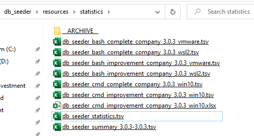

#### 4.4.1 Detailed statistical data

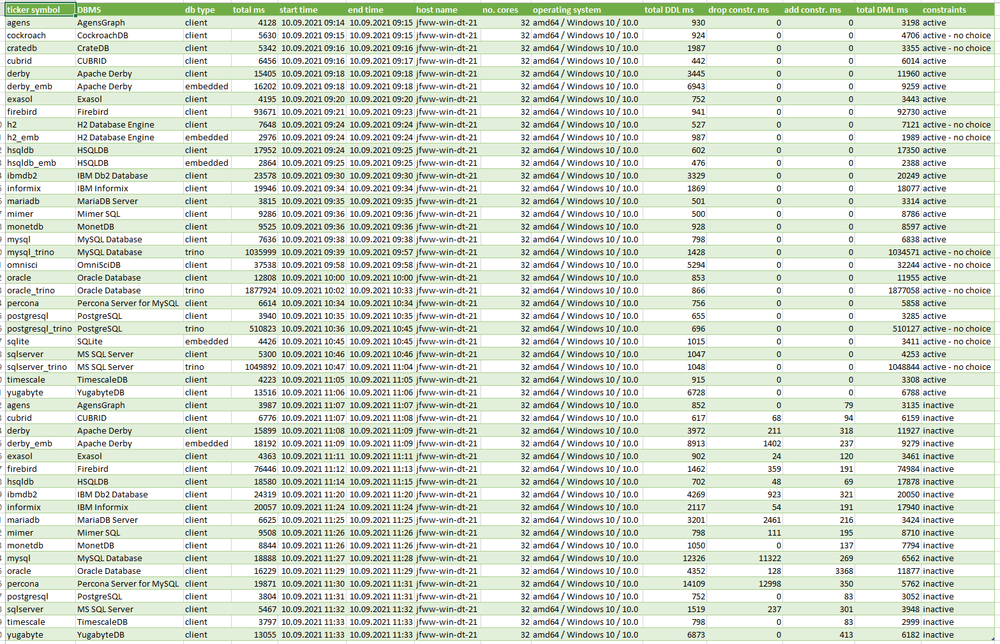

**File name syntax**: `db_seeder_<bash|cmd>_complete_<company|syntax>_<DBSeeder version>_<vmware|wsl2|win10>.<csv|tsv>`

**Explanation for the columns**:

- `ticker symbol` - internal abbreviation used for the database
- `DBMS` - official DBMS name
- `db type` - client version, embedded version or via trino
- `total ms` - total time of DDL and DML operations in milliseconds
- `start time` - date and time when the database operations were started
- `end time` - date and time when the database operations were completed
- `host name` - name of the computer connected to a computer network
- `no. cores` -  number of CPU cores used
- `operating system`
- `total DDL ms` - total time of DDL operations in milliseconds
- `drop constr. ms` - total time to drop all constraints
- `add constr. ms` - total time to add the previously dropped constraints
- `total DML ms` - total time of DML operations in milliseconds
- `constraints` - DML operations with enabled (active) or disabled (inactive) constraints (foreign, primary and unique key)

#### 4.4.2 Performance data regarding constraints

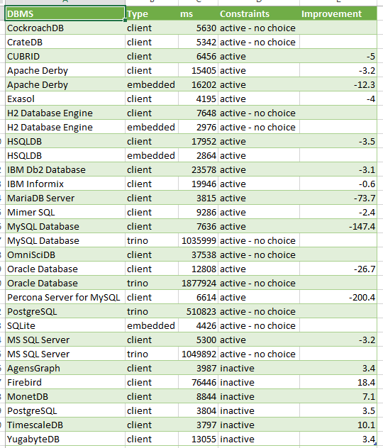

**File name syntax**: `db_seeder_<bash|cmd>_improvement_<company|syntax>_<DBSeeder version>_<vmware|wsl2|win10>.<csv|tsv>`

**Explanation for the columns**:

- `DBMS` - official DBMS name
- `Type` - client version, embedded version or via trino
- `ms` - total time of DDL and DML operations in milliseconds
- `Constraints` - DML operations with enabled (active) or disabled (inactive) constraints (foreign, primary and unique key)
- `Improvment` - improvement of total time if constraints are inactive

#### 4.4.3 Historical statistical data

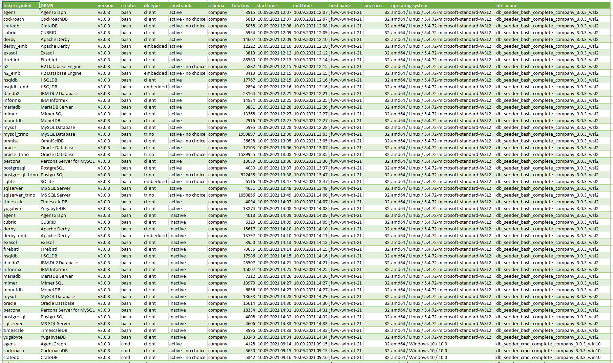

**File name syntax**: `db_seeder_summary_<first DBSeeder version>-<current DBSeeder version>.<csv|tsv>`

**Explanation for the columns**:

- `ticker symbol` - internal abbreviation used for the database
- `DBMS` - official DBMS name
- `version` - DBSeeder version
- `creator` - shell environment: `bash` or `cmd`
- `db type` - client version, embedded version or via trino
- `constraints` - DML operations with enabled (`active` and `active - no choice`) or disabled (`inactive`) constraints (foreign, primary and unique key)
- `schema` - identification term for the scheme definition used: `company` or `syntax`
- `total ms` - total time of DDL and DML operations in milliseconds
- `start time` - date and time when the database operations were started
- `end time` - date and time when the database operations were completed
- `host name` - name of the computer connected to a computer network
- `no. cores` - number of CPU cores used
- `operating system`
- `file name` - name of the file with the source data
- `total DDL ms` - total time of DDL operations in milliseconds
- `drop constr. ms` - total time to drop all constraints
- `add constr. ms` - total time to add the previously dropped constraints
- `total DML ms` - total time of DML operations in milliseconds

[//]: # (===========================================================================================)

## 5. RDBMS Specific Technical Details

[DBeaver](https://dbeaver.io) is a great tool to analyze the database content. 
In the file directory `resources/dbeaver` you will also find a file exported from DBeaver with the connection parameters currently used in DBSeeder.

[//]: # (===========================================================================================)

### 5.1 AgensGraph

- **data types**:

| **`DBSeeder`** Type | AgensGraph Database Type |
| ---            | ---                      |
| BIGINT         | BIGINT                   |
| BLOB           | BYTEA                    |
| CLOB           | TEXT                     |
| TIMESTAMP      | TIMESTAMP                |
| VARCHAR        | VARCHAR                  |

- **DDL syntax**:
    - CREATE DATABASE: see PostgreSQL 
    - CREATE SCHEMA: see PostgreSQL
    - CREATE TABLE: see PostgreSQL 
    - CREATE USER: see PostgreSQL 

- **Docker image (latest)**:
    - pull command: `docker pull bitnine/agensgraph:v2.5.0`
    - [DockerHub](https://hub.docker.com/r/bitnine/agensgraph)

- **encoding**: see PostgreSQL
  
- **issue tracking**: [GitHub](https://github.com/bitnine-oss/agensgraph/issues)
  
- **JDBC driver (latest)**:
    - version 1.4.2-c1
    - [Maven repository](https://mvnrepository.com/artifact/net.bitnine/agensgraph-jdbc)

- **source code**: [GitHub](https://github.com/bitnine-oss/agensgraph)

[//]: # (===========================================================================================)

### 5.2 Apache Derby

- **data types**:

| **`DBSeeder`** Type | Apache Derby Type |
| ---            | ---               |
| BIGINT         | BIGINT            |
| BLOB           | BLOB              |
| CLOB           | CLOB              |
| TIMESTAMP      | TIMESTAMP         |
| VARCHAR        | VARCHAR           |

- **DDL syntax**:
    - CREATE DATABASE - n/a 
    - [CREATE SCHEMA](https://db.apache.org/derby/docs/10.15/ref/index.html)
    - [CREATE TABLE](https://db.apache.org/derby/docs/10.15/ref/index.html) 
    - CREATE USER - n/a 

- **Docker image (latest - only client version)**:
    - pull command: `docker pull konnexionsgmbh/apache_derby:10.15.2.0`
    - [DockerHub](https://hub.docker.com/repository/docker/konnexionsgmbh/apache_derby)

- **encoding**: by using the following JVM parameter: `-Dderby.ui.codeset=UTF8`

- **issue tracking**: [Jira](https://issues.apache.org/jira/projects/DERBY/issues/DERBY-7013?filter=allopenissues)
  
- **JDBC driver (latest)**:
    - client version: [Maven repository](https://mvnrepository.com/artifact/org.apache.derby/derbyclient)
    - embedded version: [Maven repository](https://mvnrepository.com/artifact/org.apache.derby/derby)
  
- **source code**: [Apache Derby](https://db.apache.org/derby/dev/derby_source.html)

- **DBeaver database connection settings**:

    -- client version:
  
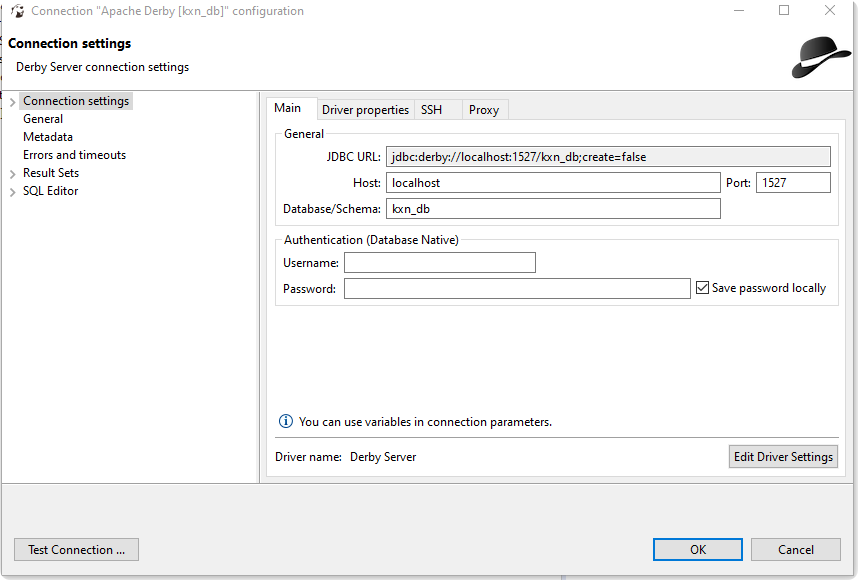

[//]: # (===========================================================================================)

### 5.3 CockroachDB

- **data types**:

| **`DBSeeder`** Type | CockroachDB Type |
| ---            | ---              |
| BIGINT         | INT              |
| BLOB           | BYTES            |
| CLOB           | STRING           |
| TIMESTAMP      | TIMESTAMP        |
| VARCHAR        | STRING           |

- **DDL syntax**:
    - [CREATE DATABASE](https://www.cockroachlabs.com/docs/v20.2/create-database.html)
    - [CREATE SCHEMA](https://www.cockroachlabs.com/docs/v20.2/create-schema.html)
    - [CREATE TABLE](https://www.cockroachlabs.com/docs/v20.2/create-table.html)
    - [CREATE USER](https://www.cockroachlabs.com/docs/v20.2/create-user.html)

- **Docker image (latest)**:
    - pull command: `docker pull cockroachdb/cockroach:v21.2.8`
    - [DockerHub](https://hub.docker.com/r/cockroachdb/cockroach)

- **encoding**: by default `utf8` encoding

- **issue tracking**: [GitHub](https://github.com/cockroachdb/cockroach/issues)

- **JDBC driver (latest)**:
    - same as PostgreSQL

- **privileged database access**: user `root`

- **source code**: [GitHub](https://github.com/cockroachdb/cockroach)

- **DBeaver database connection settings**:

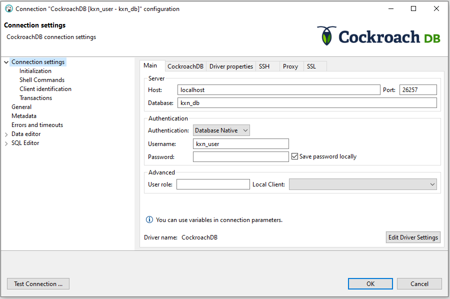

[//]: # (===========================================================================================)

### 5.4 CrateDB

- **data types**:

| **`DBSeeder`** Type | CrateDB Type |
| ---            | ---          |
| BIGINT         | BIGINT       |
| BLOB           | OBJECT       |
| CLOB           | TEXT         |
| TIMESTAMP      | TIMESTAMP    |
| VARCHAR        | TEXT         |

- **DDL syntax**:
    - CREATE DATABASE - n/a
    - CREATE SCHEMA - n/a
    - [CREATE TABLE](https://crate.io/docs/crate/reference/en/latest/sql/statements/create-table.html) 
    - [CREATE USER](https://crate.io/docs/crate/reference/en/latest/sql/statements/create-user.html) 

- **Docker image (latest)**:
    - pull command: `docker pull crate:4.7.1`
    - [DockerHub](https://hub.docker.com/_/crate)

- **encoding**: by default `utf8` encoding

- **issue tracking**: [GitHub](https://github.com/crate/crate)

- **JDBC driver (latest)**:
    - [JFrog Bintray repository](https://bintray.com/crate/crate/crate-jdbc)
  
- **privileged database access**: user `crate`

- **restrictions**:
    - no constraints (e.g. foreign keys or unique keys)
    - no transaction concept
    - no triggers 
    - only a very proprietary BLOB implementation

- **source code**: [GitHub](https://github.com/crate/crate)

- **DBeaver database connection settings**:


[//]: # (===========================================================================================)

### 5.5 CUBRID

- **data types**:

| **`DBSeeder`** Type | CUBRID Type |
| ---            | ---         |
| BIGINT         | INT         |
| BLOB           | BLOB        |
| CLOB           | CLOB        |
| TIMESTAMP      | TIMESTAMP   |
| VARCHAR        | VARCHAR     |

- **DDL syntax**:
    - CREATE DATABASE - n/a   
    - CREATE SCHEMA - n/a
    - [CREATE TABLE](https://www.cubrid.org/manual/en/11.0/sql/schema/table_stmt.html?highlight=create%20database#create-table) 
    - [CREATE USER](https://www.cubrid.org/manual/en/11.0/sql/authorization.html) 

- **Docker image (latest)**:
    - pull command: `docker pull cubrid/cubrid:11.0`
    - [DockerHub](https://hub.docker.com/r/cubrid/cubrid)

- **encoding**: by specifying after the database name when database is created: `kxn_db de_DE.utf8`

- **issue tracking**: 
    - [Jira](http://jira.cubrid.org/projects/CBRD/issues/CBRD-23979?filter=allissues&orderby=created+DESC)

- **JDBC driver (latest)**:
    - [Maven repository](https://mvnrepository.com/artifact/cubrid/cubrid-jdbc?repo=cubrid)
  
- **privileged database access**: users `DBA` and `PUBLIC`

- **restrictions**:  no full UTF-8 support

- **source code**: [GitHub](https://github.com/CUBRID/cubrid)

- **DBeaver database connection settings**:


[//]: # (===========================================================================================)

### 5.6 Exasol
- **data types**:

| **`DBSeeder`** Type | Exasol Type      |
| ---            | ---              |
| BIGINT         | BIGINT           |
| BLOB           | VARCHAR(2000000) |
| CLOB           | VARCHAR(2000000) |
| TIMESTAMP      | TIMESTAMP        |
| VARCHAR        | VARCHAR          |

- **DDL syntax**:
    - CREATE DATABASE - n/a
    - [CREATE SCHEMA](https://docs.exasol.com/db/latest/sql/create_schema.htm) 
    - [CREATE TABLE](https://docs.exasol.com/latest/sql/create_table.htm) 
    - [CREATE USER](https://docs.exasol.com/latest/sql/create_user.htm) 

- **Docker image (latest)**:
    - pull command: `docker pull exasol/docker-db:7.1.9`
    - [DockerHub](https://hub.docker.com/r/exasol/docker-db)

- **JDBC driver (latest)**:
    - [Maven repository](https://mvnrepository.com/artifact/com.exasol/exasol-jdbc)

- **privileged database access**: user `sys` password `exasol` 

- **restrictions**:
    - no unique key constraints

- **DBeaver database connection settings**:

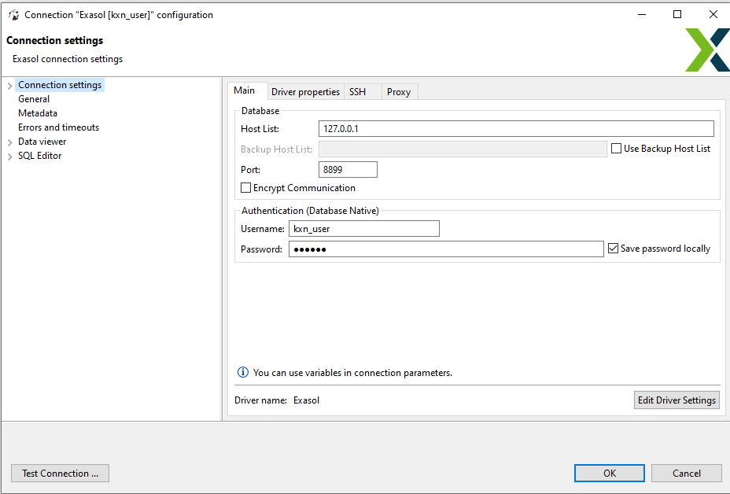

[//]: # (===========================================================================================)

### 5.7 Firebird

- **data types**:

| **`DBSeeder`** Type | Firebird Type   |
| ---            | ---             |
| BIGINT         | INTEGER         |
| BLOB           | BLOB            |
| CLOB           | BLOB SUB_TYPE 1 |
| TIMESTAMP      | TIMESTAMP       |
| VARCHAR        | VARCHAR         |

- **DDL syntax**:
    - [CREATE DATABASE](https://firebirdsql.org/file/documentation/html/en/refdocs/fblangref25/firebird-25-language-reference.html#fblangref25-ddl-db-create) 
    - CREATE SCHEMA - n/a
    - [CREATE TABLE](https://firebirdsql.org/file/documentation/html/en/refdocs/fblangref25/firebird-25-language-reference.html#fblangref25-ddl-tbl) 
    - [CREATE USER](https://firebirdsql.org/file/documentation/release_notes/html/en/3_0/rnfb30-access-sql.html) 

- **Docker image (latest)**:
    - pull command: `docker pull jacobalberty/firebird:v4.0.1`
    - [DockerHub](https://hub.docker.com/r/jacobalberty/firebird)

- **encoding**: by using the following JDBC URL parameter: `encoding=UTF8`
  
- **issue tracking**: [GitHub](https://github.com/FirebirdSQL/firebird/issues)

- **JDBC driver (latest)**:
    - [Maven repository](https://mvnrepository.com/artifact/org.firebirdsql.jdbc/jaybird)

- **privileged database access**: user `SYSDBA`

- **source code**: [GitHub](https://github.com/FirebirdSQL/firebird)

- **DBeaver database connection settings**:

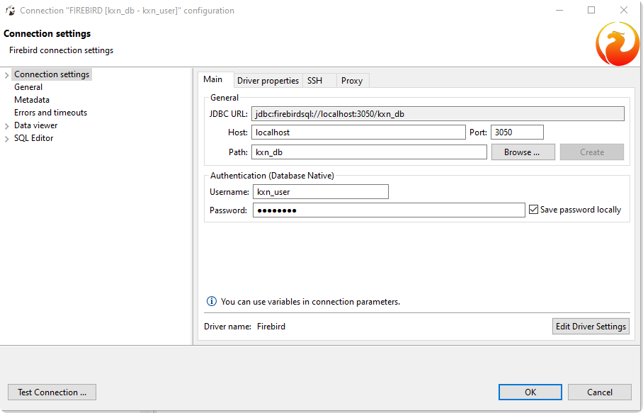

[//]: # (===========================================================================================)

### 5.8 H2 Database Engine

- **data types**:

| **`DBSeeder`** Type | H2 Database Engine Type |
| ---            | ---                     |
| BIGINT         | BIGINT                  |
| BLOB           | BLOB                    |
| CLOB           | CLOB                    |
| TIMESTAMP      | TIMESTAMP               |
| VARCHAR        | VARCHAR                 |

- **DDL syntax**:
    - CREATE DATABASE - n/a  
    - [CREATE SCHEMA](https://www.h2database.com/html/commands.html#create_schema)
    - [CREATE TABLE](https://www.h2database.com/html/commands.html#create_table) 
    - [CREATE USER](https://www.h2database.com/html/commands.html#create_user) 

- **Docker image (latest)**:
    - pull command: `docker pull konnexionsgmbh/h2_database_engine:2.1.212`
    - [DockerHub](https://hub.docker.com/repository/docker/konnexionsgmbh/h2_database_engine)

- **encoding**: H2 internally uses Unicode, and supports all character encoding systems and character sets supported by the virtual machine you use.
  
- **issue tracking**: [GitHub](https://github.com/h2database/h2database)

- **JDBC driver (latest)**:
    - [Maven repository](https://mvnrepository.com/artifact/com.h2database/h2)

- **privileged database access**: user `sa`

- **source code**: [GitHub](https://github.com/h2database/h2database)

- **DBeaver database connection settings**:

  -- client version:
  
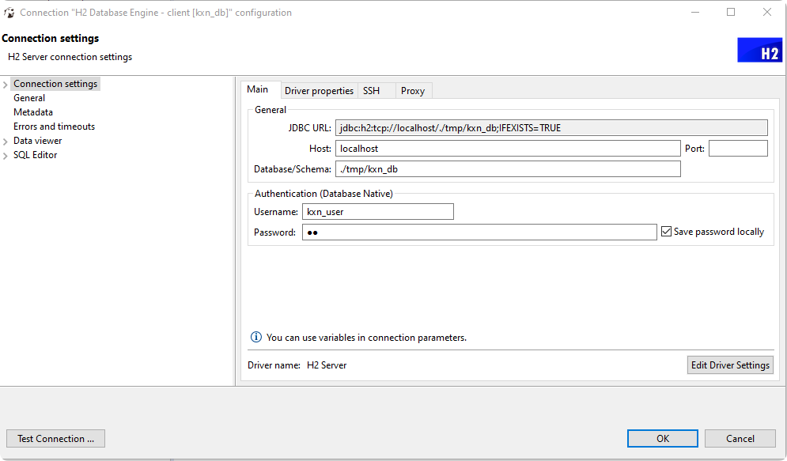
  
[//]: # (===========================================================================================)

[//]: # (===========================================================================================)

### 5.9 HeavyDB

- **data types**:

| **`DBSeeder`** Type | HeavyDB Type       |
|---------------------|--------------------|
| BIGINT              | BIGINT             |
| BLOB                | TEXT ENCODING NONE |
| CLOB                | TEXT ENCODING NONE |
| TIMESTAMP           | TIMESTAMP(0)       |
| VARCHAR             | TEXT ENCODING NONE |

- **DDL syntax**:
  - [CREATE DATABASE](https://docs.heavy.ai/sql/data-definition-ddl/users-and-databases#create-database)
  - CREATE SCHEMA - n/a
  - [CREATE TABLE](https://docs.heavy.ai/sql/data-definition-ddl/tables#create-table)
  - [CREATE USER](https://docs.heavy.ai/sql/data-definition-ddl/users-and-databases#create-user)

- **Docker image (latest)**:
  - pull command: `docker pull omnisci/core-os-cpu`
  - [DockerHub](https://hub.docker.com/_/omnisci-open-source-edition)

- **encoding**: no special configuration should be needed

- **issue tracking**: [GitHub](https://github.com/heavyai/heavydb/issues)

- **JDBC driver (latest)**:
  - [Maven repository](https://mvnrepository.com/artifact/com.omnisci/omnisci-jdbc)

- **privileged database access**:
  - database: `omnisci`
  - user: `admin`

- **restrictions**:
  - column and table names case sensitive
  - max. column length 32767 bytes
  - no binary columns
  - no constraints, e.g. unique keys
  - no foreign / referential keys
  - no primary key
  - no triggerss

- **source code**: [GitHub](https://github.com/heavyai/heavydb)

- **DBeaver database connection settings**:


### 5.10 HSQLDB

- **data types**:

| **`DBSeeder`** Type | HSQLDB Type |
|---------------------| ---         |
| BIGINT              | BIGINT      |
| BLOB                | BLOB        |
| CLOB                | CLOB        |
| TIMESTAMP           | TIMESTAMP   |
| VARCHAR             | VARCHAR     |

- **DDL syntax**:
    - CREATE DATABASE - n/a  
    - [CREATE SCHEMA](http://www.hsqldb.org/doc/2.0/guide/guide.html#dbc_schema_creation)
    - [CREATE TABLE](http://www.hsqldb.org/doc/2.0/guide/guide.html#dbc_tables) 
    - [CREATE USER](http://www.hsqldb.org/doc/2.0/guide/accesscontrol-chapt.html) 

- **Docker image (latest)**:
    - pull command: `docker pull konnexionsgmbh/hypersql_database:2.6.1`
    - [DockerHub](https://hub.docker.com/repository/docker/konnexionsgmbh/hypersql_database)

- **encoding**: by using the following system property `sqlfile.charset=UTF-8`.
  
- **issue tracking**: [SourceForge](https://sourceforge.net/p/hsqldb/_list/tickets)

- **JDBC driver (latest)**:
    - [Maven repository](https://mvnrepository.com/artifact/org.hsqldb/hsqldb)

- **privileged database access**: user `SA`

- **source code**: [SourceForge](https://sourceforge.net/projects/hsqldb/files/hsqldb)

- **DBeaver database connection settings**:

  -- client version:
  
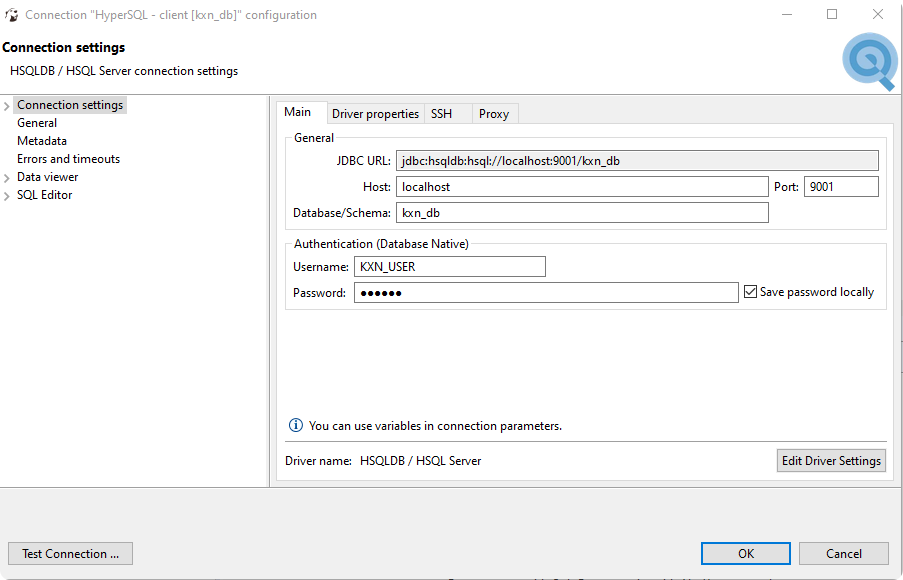
  
[//]: # (===========================================================================================)

### 5.11 IBM Db2 Database

- **data types**:

| **`DBSeeder`** Type | IBM Db2 Database Type |
| ---            | ---                   |
| BIGINT         | BIGINT                |
| BLOB           | BLOB                  |
| CLOB           | CLOB                  |
| TIMESTAMP      | TIMESTAMP             |
| VARCHAR        | VARCHAR               |

- **DDL syntax**:
    - [CREATE DATABASE](https://www.ibm.com/support/knowledgecenter/SSEPGG_11.5.0/com.ibm.db2.luw.admin.cmd.doc/doc/r0001941.html) 
    - [CREATE SCHEMA](https://www.ibm.com/support/knowledgecenter/SSFMBX/com.ibm.swg.im.dashdb.sql.ref.doc/doc/r0000925.html)
    - [CREATE TABLE](https://https://www.ibm.com/support/knowledgecenter/SSEPGG_11.5.0/com.ibm.db2.luw.sql.ref.doc/doc/r0000927.html) 
    - [CREATE USER](https://www.ibm.com/support/knowledgecenter/SSEPGG_11.5.0/com.ibm.db2.luw.sql.ref.doc/doc/r0002172.html) 

- **Docker image (latest)**:
    - pull command: `docker pull ibmcom/db2:11.5.7.0a`
    - [DockerHub](https://hub.docker.com/r/ibmcom/db2)

- **encoding**:
    - by using the CCSID clause in the CREATE statements for any of the following objects:
        - Database
        - Table space
        - Table
        - procedure or function
  
- **JDBC driver (latest)**:
    - [Maven repository](https://mvnrepository.com/artifact/com.ibm.db2/jcc)

- **privileged database access**: user `db2inst1`

- **restrictions**: the IBM Db2 DBMS only accepts operating system accounts as database users 

- **DBeaver database connection settings**:

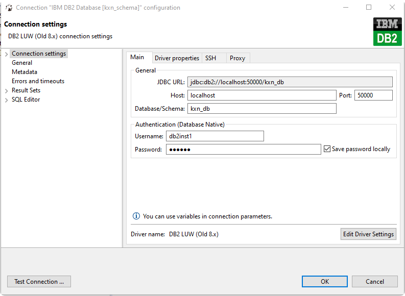

[//]: # (===========================================================================================)

### 5.12 IBM Informix

- **data types**:

| **`DBSeeder`** Type | IBM Informix Database Type |
| ---            | ---                        |
| BIGINT         | BIGINT                     |
| BLOB           | BLOB                       |
| CLOB           | CLOB                       |
| TIMESTAMP      | DATETIME YEAR TO FRACTION  |
| VARCHAR        | VARCHAR (1-254) / LVARCHAR |

- **DDL syntax**:
    - [CREATE DATABASE](https://www.ibm.com/support/knowledgecenter/SSGU8G_14.1.0/com.ibm.sqls.doc/ids_sqs_0368.htm) 
    - CREATE SCHEMA - n/a
    - [CREATE TABLE](https://www.ibm.com/support/knowledgecenter/SSGU8G_14.1.0/com.ibm.sqls.doc/ids_sqs_0509.htm) 
    - [CREATE USER](https://www.ibm.com/support/knowledgecenter/SSGU8G_14.1.0/com.ibm.sqls.doc/ids_sqs_1821.htm) 

- **Docker image (latest)**:
    - pull command: `docker pull ibmcom/informix-developer-database:14.10.FC7W1DE`
    - [DockerHub](https://hub.docker.com/r/ibmcom/informix-developer-database)

- **encoding**:
    - code-set conversion value is extracted from the DB_LOCALE value specified at the time the connection is made
  
- **JDBC driver (latest)**:
    - [Maven repository](https://mvnrepository.com/artifact/com.ibm.informix/jdbc)

- **privileged database access**: 
    - user `informix`
    - password `in4mix`
    - database / schema `sysmaster`
    - INFORMIXSERVER `informix`

- **restrictions**: 
    - the IBM Informix DBMS only accepts operating system accounts or users mapped to operating system accounts as database users 
    - no named constraints in ALTER TABLE ADD CONSTRAINT

- **DBeaver database connection settings**:

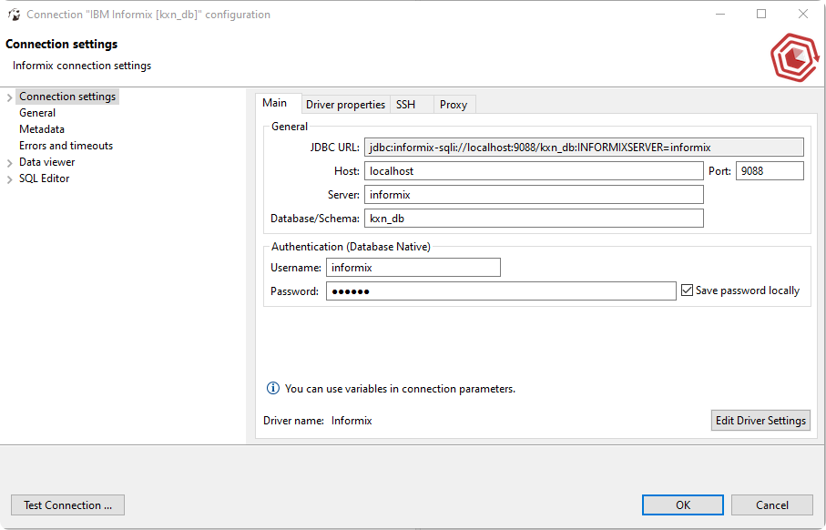

[//]: # (===========================================================================================)

### 5.13 MariaDB Server

- **data types**:

| **`DBSeeder`** Type | MariaDB Type |
| ---            | ---          |
| BIGINT         | BIGINT       |
| BLOB           | LONGBLOB     |
| CLOB           | LONGTEXT     |
| TIMESTAMP      | DATETIME     |
| VARCHAR        | VARCHAR      |

- **DDL syntax**:
    - [CREATE DATABASE](https://mariadb.com/kb/en/create-database) 
    - CREATE SCHEMA - n/a
    - [CREATE TABLE](https://mariadb.com/kb/en/create-table) 
    - [CREATE USER](https://mariadb.com/kb/en/create-user) 

- **Docker image (latest)**:
    - pull command: `docker pull mariadb:10.7.3-focal`
    - [DockerHub](https://hub.docker.com/_/mariadb)

- **encoding**:
    - server level: `SET character_set_server = 'latin2';`
    - database level: `CHARACTER SET = 'keybcs2'`
    - table level: `CHARACTER SET 'utf8'`
    - column level: `CHARACTER SET 'greek'`
  
- **issue tracking**: [Jira](https://jira.mariadb.org/secure/Dashboard.jspa)

- **JDBC driver (latest)**:
    - [Maven repository](https://mvnrepository.com/artifact/org.mariadb.jdbc/mariadb-java-client)

- **privileged database access**:
    - user: `mysql`
    - password; `root`

- **source code**: [GitHub](https://github.com/MariaDB/server)

- **DBeaver database connection settings**:

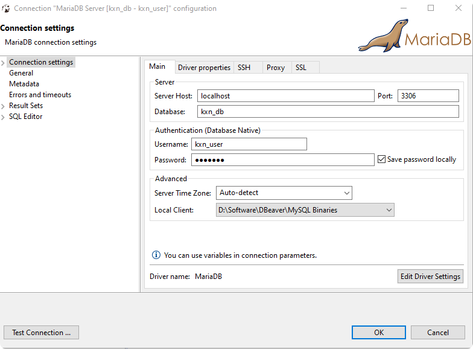

[//]: # (===========================================================================================)

### 5.14 Mimer SQL

- **data types**:

| **`DBSeeder`** Type | MimerSQL Type |
| ---            | ---           |
| BIGINT         | BIGINT        |
| BLOB           | BLOB          |
| CLOB           | CLOB          |
| TIMESTAMP      | TIMESTAMP     |
| VARCHAR        | NVARCHAR      |

- **DDL syntax**:
    - [CREATE DATABASE](https://download.mimer.com/pub/developer/docs/html_110/Mimer_SQL_Engine_DocSet/index.htm) 
    - CREATE SCHEMA - n/a
    - [CREATE TABLE](https://download.mimer.com/pub/developer/docs/html_110/Mimer_SQL_Engine_DocSet/index.htm) 
    - [CREATE USER](https://download.mimer.com/pub/developer/docs/html_110/Mimer_SQL_Engine_DocSet/index.htm) 

- **Docker image (latest)**:
    - pull command: `docker pull mimersql/mimersql_v11.0.5a`
    - [DockerHub](https://hub.docker.com/r/mimersql/mimersql_v11.0)

- **encoding**: NCHAR, NVARCHAR
  
- **JDBC driver (latest)**: 
    - [Mimer Website](https://developer.mimer.com/download/mimer-jdbc-driver-3-40-java-ee-and-java-se)

- **privileged database access**:
    - database; `mimerdb`
    - user: `SYSADM`

- **DBeaver database connection settings**:

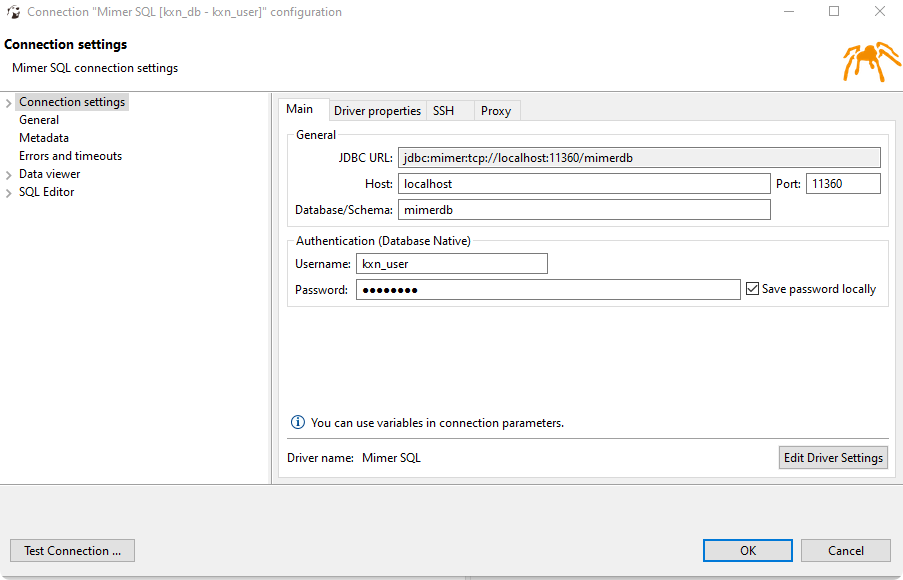

[//]: # (===========================================================================================)

### 5.15 MonetDB

- **data types**:

| **`DBSeeder`** Type | MonetDB Type |
| ---            | ---          |
| BIGINT         | BIGINT       |
| BLOB           | BLOB         |
| CLOB           | CLOB         |
| TIMESTAMP      | TIMESTAMP    |
| VARCHAR        | VARCHAR      |

- **DDL syntax**:
    - CREATE DATABASE - n/a
    - [CREATE SCHEMA](https://www.monetdb.org/Documentation/SQLReference/DataDefinition/SchemaDefinitions) 
    - [CREATE TABLE](https://www.monetdb.org/Documentation/SQLReference/TableDefinitions) 
    - [CREATE USER](https://www.monetdb.org/Documentation/SQLreference/SQLSyntaxOverview#CREATE_USER) 

- **Docker image (latest)**:
    - pull command: `docker pull monetdb/monetdb:Jan2022-SP2`
    - [DockerHub](https://hub.docker.com/r/monetdb/monetdb)

- **encoding**: no special configuration should be needed
  
- **issue tracking**: [GitHub](https://github.com/MonetDB/MonetDB/issues)

- **JDBC driver (latest)**:
    - [MonetDB Java Download Area](https://www.monetdb.org/downloads/Java)

- **privileged database access**:
    - database: `demo`
    - user: `monetdb`
    - password: `monetdb`

- **source code**: [GitHub](https://github.com/MonetDB/MonetDB)

- **DBeaver database connection settings**:

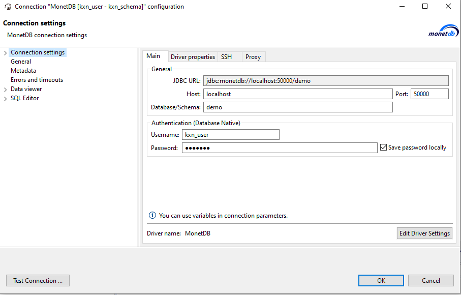

[//]: # (===========================================================================================)

### 5.16 MySQL Database

- **data types**:

| **`DBSeeder`** Type | MySQL Database Type |
| ---            | ---                 |
| BIGINT         | BIGINT              |
| BLOB           | LONGBLOB            |
| CLOB           | LONGTEXT            |
| TIMESTAMP      | DATETIME            |
| VARCHAR        | VARCHAR             |

- **DDL syntax**:
    - [CREATE DATABASE](https://dev.mysql.com/doc/refman/8.0/en/create-database.html) 
    - CREATE SCHEMA - n/a
    - [CREATE TABLE](https://dev.mysql.com/doc/refman/8.0/en/create-table.html) 
    - [CREATE USER](https://dev.mysql.com/doc/refman/8.0/en/create-user.html) 

- **Docker image (latest)**:
    - pull command: `docker pull mysql:8.0.28`
    - [DockerHub](https://hub.docker.com/_/mysql)

- **encoding**: for applications that store data using the default MySQL character set and collation (utf8mb4, utf8mb4_0900_ai_ci), no special configuration should be needed
  
- **JDBC driver (latest)**:
    - [Maven repository](https://mvnrepository.com/artifact/mysql/mysql-connector-java)

- **privileged database access**:
    - database: `sys`
    - user: `root`

- **source code**: [GitHub](https://github.com/mysql/mysql-server)

- **DBeaver database connection settings**:


[//]: # (===========================================================================================)

### 5.17 Oracle Database

- **data types**:

| **`DBSeeder`** Type | Oracle Database Type |
| ---            | ---                  |
| BIGINT         | NUMBER               |
| BLOB           | BLOB                 |
| CLOB           | CLOB                 |
| TIMESTAMP      | TIMESTAMP            |
| VARCHAR        | VARCHAR2             |

- **DDL syntax**:
    - CREATE DATABASE - n/a 
    - CREATE SCHEMA - n/a
    - [CREATE TABLE](https://docs.oracle.com/en/database/oracle/oracle-database/21/sqlrf/CREATE-TABLE.html#GUID-F9CE0CC3-13AE-4744-A43C-EAC7A71AAAB6) 
    - [CREATE USER](https://docs.oracle.com/en/database/oracle/oracle-database/21/sqlrf/CREATE-USER.html#GUID-F0246961-558F-480B-AC0F-14B50134621C) 

- **Docker image**: [DockerHub](https://github.com/oracle/docker-images/tree/master/OracleDatabase)

- **encoding**: since Oracle Database 12c Release 2 the default database character set used is the Unicode character set AL32UTF8
  
- **JDBC driver (latest)**:
    - [Maven repository](https://mvnrepository.com/artifact/com.oracle.ojdbc/ojdbc11)

- **privileged database access**:
    - database: `orclpdb1`
    - user: `SYS AS SYSDBA`

- **DBeaver database connection settings**:

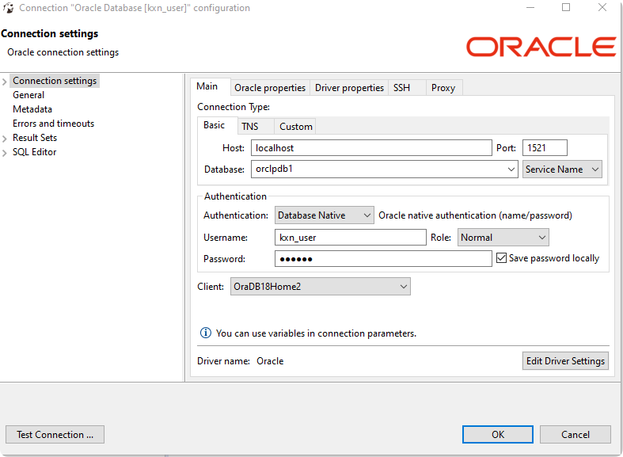

[//]: # (===========================================================================================)

### 5.18 Percona Server for MySQL

- **data types**:

| **`DBSeeder`** Type | Percona Sercver Type |
| ---            | ---                  |
| BIGINT         | BIGINT               |
| BLOB           | LONGBLOB             |
| CLOB           | LONGTEXT             |
| TIMESTAMP      | DATETIME             |
| VARCHAR        | VARCHAR              |

- **DDL syntax**:
    - CREATE DATABASE: see MySQL Database 
    - CREATE SCHEMA - n/a
    - CREATE TABLE: see MySQL Database 
    - CREATE USER: see MySQL Database 

- **Docker image (latest)**:
    - pull command: `docker pull percona/percona-server:8.0.27-18`
    - [DockerHub](https://hub.docker.com/_/percona-server)

- **encoding**: for applications that store data using the default MySQL character set and collation (utf8mb4, utf8mb4_0900_ai_ci), no special configuration should be needed
  
- **issue tracking**: [Jira](https://jira.percona.com/projects/PS/issues/PS-7237?filter=allopenissues)

- **JDBC driver (latest)**:
    - same as MySQL

- **privileged database access**:
    - database: `sys`
    - user: `root`

- **source code**: [GitHub](https://github.com/percona/percona-server)

- **DBeaver database connection settings**:

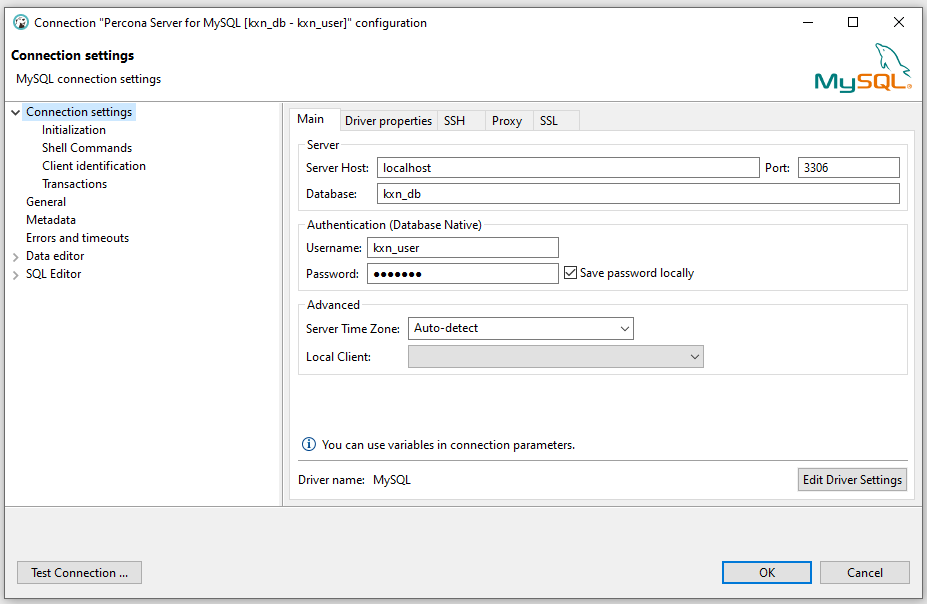

[//]: # (===========================================================================================)

### 5.19 PostgreSQL

- **data types**:

| **`DBSeeder`** Type | PostgreSQL Type |
| ---            | ---             |
| BIGINT         | BIGINT          |
| BLOB           | BYTEA           |
| CLOB           | TEXT            |
| TIMESTAMP      | TIMESTAMP       |
| VARCHAR        | VARCHAR         |

- **DDL syntax**:
    - [CREATE DATABASE](https://www.postgresql.org/docs/12/sql-createdatabase.html) 
    - [CREATE SCHEMA](https://www.postgresql.org/docs/12/sql-createschema.html)
    - [CREATE TABLE](https://www.postgresql.org/docs/12/sql-createtable.html) 
    - [CREATE USER](https://www.postgresql.org/docs/12/sql-createuser.html) 

- **Docker image (latest)**:
    - pull command: `docker pull postgres:14.2-alpine`
    - [DockerHub](https://hub.docker.com/_/postgres)

- **encoding**: when creating the database: `CREATE DATABASE testdb WITH ENCODING 'EUC_KR' ...`

- **issue tracking**: [PostgreSQL](https://www.postgresql.org/list/pgsql-bugs)
  
- **JDBC driver (latest)**:
    - [Maven repository](https://mvnrepository.com/artifact/org.postgresql/postgresql)

- **documentation**: [The PostgreSQL JDBC Interface](https://jdbc.postgresql.org/documentation/head/index.html)
 
- **release notes**: [History of Changes](https://jdbc.postgresql.org/documentation/changelog.html)

- **source code**: [GitHub](https://github.com/postgres/postgres)

- **DBeaver database connection settings**:

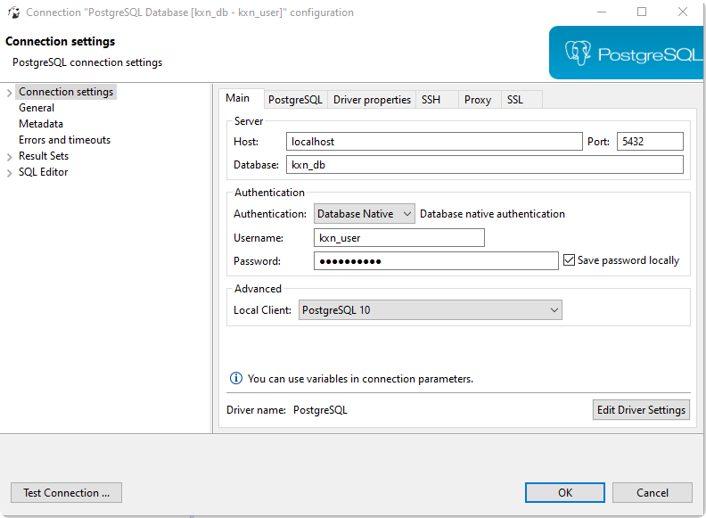

[//]: # (===========================================================================================)

### 5.20 SQL Server

- **data types**:

| **`DBSeeder`** Type | SQL Server Type |
| ---            | ---             |
| BIGINT         | BIGINT          |
| BLOB           | VARBINARY (MAX) |
| CLOB           | VARCHAR (MAX)   |
| TIMESTAMP      | DATETIME2       |
| VARCHAR        | VARCHAR         |

- **DDL syntax**:
    - [CREATE DATABASE](https://docs.microsoft.com/en-us/sql/t-sql/statements/create-database-transact-sql?view=sql-server-ver15)
    - [CREATE SCHEMA](https://docs.microsoft.com/en-us/sql/t-sql/statements/create-schema-transact-sql?view=sql-server-ver15)
    - [CREATE TABLE](https://docs.microsoft.com/en-us/sql/t-sql/statements/create-table-transact-sql?view=sql-server-ver15)
    - [CREATE USER](https://docs.microsoft.com/en-us/sql/t-sql/statements/create-user-transact-sql?view=sql-server-ver15)

- **Docker image (latest)**:
    - pull command: `docker pull mcr.microsoft.com/mssql/server:2019-CU15-ubuntu-20.04`
    - [DockerHub](https://hub.docker.com/_/microsoft-mssql-server)

- **encoding**: to use the UTF-8 collations that are available in SQL Server 2019 (15.x), you must select UTF-8 encoding-enabled collations (_UTF8)

- **JDBC driver (latest)**:
    - [Maven repository](https://mvnrepository.com/artifact/com.microsoft.sqlserver/mssql-jdbc)

- **privileged database access**:
    - database: `master`
    - user: `sa`

- **restrictions**: no full UTF-8 support in the given Docker images

- **DBeaver database connection settings**:


[//]: # (===========================================================================================)

### 5.21 SQLite

- **data types**:

| **`DBSeeder`** Type | SQLite Type |
| ---            | ---         |
| BIGINT         | INTEGER     |
| BLOB           | BLOB        |
| CLOB           | CLOB        |
| TIMESTAMP      | DATETIME    |
| VARCHAR        | VARCHAR2    |

- **DDL syntax**:
    - CREATE DATABASE - n/a
    - CREATE SCHEMA - n/a
    - [CREATE TABLE](https://sqlite.org/lang_createtable.html) 
    - CREATE USER - n/a     

- **encoding**: by using the following parameter: `PRAGMA encoding='UTF-8';`
  
- **issue tracking**: [SQLite](https://www.sqlite.org/src/wiki?name=Bug+Reports)

- **JDBC driver (latest)**:
    - [Maven repository](https://mvnrepository.com/artifact/org.xerial/sqlite-jdbc)
    - determines also the DBMS version

- **restrictions**:
    - no Docker image necessary, hence not available
    - no user management 

- **source code**: [SQLite](https://sqlite.org/src/doc/trunk/README.md)

- **DBeaver database connection settings**:


[//]: # (===========================================================================================)

### 5.22 TimescaleDB

- **data types**:

| **`DBSeeder`** Type | AgensGraph Database Type |
| ---            | ---                      |
| BIGINT         | BIGINT                   |
| BLOB           | BYTEA                    |
| CLOB           | TEXT                     |
| TIMESTAMP      | TIMESTAMP                |
| VARCHAR        | VARCHAR                  |

- **DDL syntax**:
    - CREATE DATABASE: see PostgreSQL
    - CREATE SCHEMA: see PostgreSQL
    - CREATE TABLE: see PostgreSQL
    - CREATE USER: see PostgreSQL

- **Docker image (latest)**:
    - pull command: `docker pull timescale/timescaledb:2.6.1-pg14`
    - [DockerHub](https://hub.docker.com/r/timescale/timescaledb)

- **encoding**: see PostgreSQL

- **issue tracking**: [GitHub](https://github.com/timescale/timescaledb/issues)

- **JDBC driver (latest)**:
    - same as PostgreSQL

- **source code**: [GitHub](https://github.com/timescale/timescaledb)


[//]: # (===========================================================================================)

### 5.23 trino

- **data types**:

| **`DBSeeder`** Type | trino Type |
| ---            | ---        |
| BIGINT         | BIGINT     |
| BLOB           | BLOB       |
| CLOB           | CLOB       |
| TIMESTAMP      | TIMESTAMP  |
| VARCHAR        | VARCHAR    |

- **DDL syntax**:
    - CREATE DATABASE - n/a
    - [CREATE SCHEMA](https://trino.io/docs/current/sql/create-schema.html)
    - [CREATE TABLE](https://trino.io/docs/current/sql/create-table.html)
    - CREATE USER - n/a

- **Docker image (latest)**:
    - pull command: `docker pull trinodb/trino:368`
    - [DockerHub](https://hub.docker.com/r/trinodb/trino)

- **encoding**: full support of UTF-8 (see [here](https://trino.io/docs/current/release/release-0.102.html?highlight=encoding))

- **issue tracking**: [GitHub](https://github.com/trinodb/trino/issues)

- **JDBC driver (latest)**:
    - [Maven repository](https://mvnrepository.com/artifact/io.trino/trino-jdbc)

- **source code**: [GitHub](https://github.com/trinodb/trino)

- **DBeaver database connection settings**:

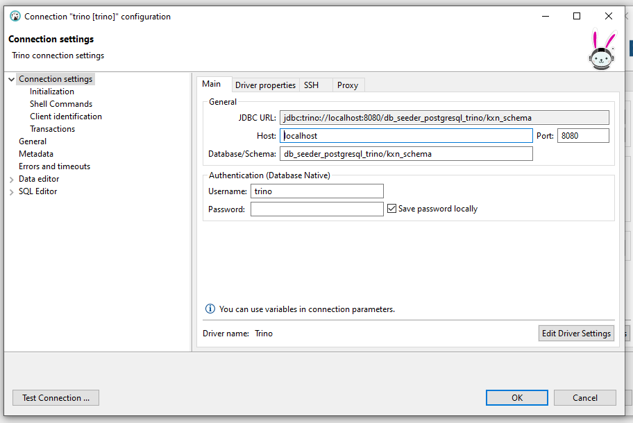

[//]: # (===========================================================================================)

### 5.24 VoltDB

- **data types**:

| **`DBSeeder`** Type | VoltDB Type        |
| ---            | ---                |
| BIGINT         | BIGINT             |
| BLOB           | VARBINARY(1048576) |
| CLOB           | VARCHAR(1048576)   |
| TIMESTAMP      | TIMESTAMP          |
| VARCHAR        | VARCHAR            |

- **DDL syntax**:
    - CREATE DATABASE - n/a  
    - CREATE SCHEMA - n/a  
    - [CREATE TABLE](https://docs.voltdb.com/UsingVoltDB/ddlref_createtable.php) 
    - CREATE USER - n/a  

- **Docker image (latest)**:
    - pull command: `docker pull voltdb/voltdb-community:9.2.1`
    - [DockerHub](https://hub.docker.com/r/voltdb/voltdb-community)

- **issue tracking**: [Jira](https://issues.voltdb.com/secure/Dashboard.jspa)

- **JDBC driver (latest)**:
    - [Maven repository](https://mvnrepository.com/artifact/org.hsqldb/hsqldb)

- **restrictions**: no support of autoincrement, check constraints or foreign keys

- **source code**: [GitHub](https://github.com/VoltDB/voltdb)

- **DBeaver database connection settings**:

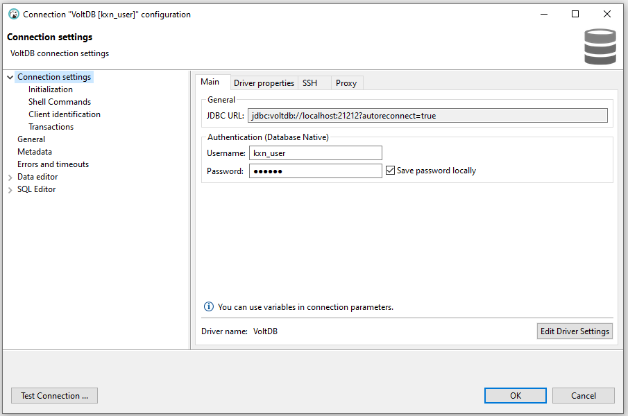

[//]: # (===========================================================================================)

### 5.25 YugabyteDB

- **data types**:

| **`DBSeeder`** Type | YugabyteDB Database Type |
| ---            | ---                      |
| BIGINT         | BIGINT                   |
| BLOB           | BYTEA                    |
| CLOB           | TEXT                     |
| TIMESTAMP      | TIMESTAMP                |
| VARCHAR        | VARCHAR                  |

- **DDL syntax**:
    - [CREATE DATABASE](https://docs.yugabyte.com/latest/api/ysql/commands/ddl_create_database) 
    - [CREATE SCHEMA](https://docs.yugabyte.com/latest/api/ysql/commands/ddl_create_schema)
    - [CREATE TABLE](https://docs.yugabyte.com/latest/api/ysql/commands/ddl_create_table) 
    - [CREATE USER](https://docs.yugabyte.com/latest/api/ysql/commands/dcl_create_user) 

- **Docker image (latest)**:
    - pull command: `docker pull yugabytedb/yugabyte:2.13.0.1-b2`
    - [DockerHub](https://hub.docker.com/r/yugabytedb/yugabyte)

- **encoding**: see PostgreSQL
  
- **issue tracking**: [GitHub](https://github.com/yugabyte/yugabyte-db/issues)

- **JDBC driver (latest)**:
    - [Maven repository](https://mvnrepository.com/artifact/com.yugabyte/jdbc-yugabytedb)

- **source code**: [GitHub](https://github.com/yugabyte/yugabyte-db)

- **DBeaver database connection settings**:


## <a name="trino"></a> 6. trino

[trino](https://trino.io) can integrate the following DBMS, among others:

- MySQL via the [MySQL Connector](https://trinodb.io/docs/current/connector/mysql.html),
- Oracle via the [Oracle Connector](https://trinodb.io/docs/current/connector/oracle.html), and
- PostgreSQL via the [PostgreSQL Connector](https://trinodb.io/docs/current/connector/postgresql.html).
- SQL Server via the [SQL Server Connector](https://trinodb.io/docs/current/connector/sqlserver.html),

**`DBSeeder`** makes it possible to use trino's JDBC driver and the corresponding connectors as an alternative to the JDBC drivers of the DBMS suppliers.
To use the trino JDBC driver, a trino server is required.
With the script `db_seeder_trino_environment` a trino server can be set up.
Since trino does not support the Windows operating system, a suitable Docker image is created for Windows.
For Linux, e.g. Ubuntu, the script can alternatively be used to perform a local installation of the trino server.
