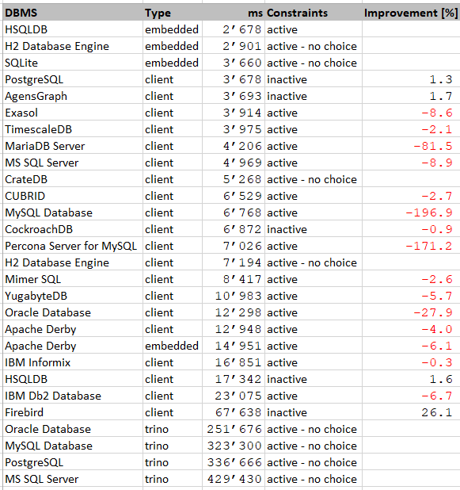

# DBSeeder - Release Notes


----

## Version 3.0.7

Release Date: dd.mm.2022

### System Requirements

- Operating system: any Java-enabled Linux, Mac or Windows variant
- Docker Desktop Community: 4.0.0 (e.g. from [Docker for Windows release notes](https://docs.docker.com/docker-for-windows/release-notes){:target="_blank"})
- Gradle Build Tool: 7 (e.g. from [here](https://gradle.org/releases){:target="_blank"})
- Java Development Kit 16 or 17, (e.g. from [here](https://jdk.java.net/java-se-ri/17){:target="_blank"})

#### optional: 
- Eclipse IDE: 2021.12 (e.g. from [Eclipse Download Page](https://www.eclipse.org/downloads){:target="_blank"})
- an environment variable called `HOME_ECLIPSE` that points to the installation directory of Eclipse IDE, e.g.: `C:\Software\eclipse\java-2021-12\eclipse`

### New Features

- Rebranding from OmniSciDB to HeavyDB

### Modified Features

- AgensGraph: DBMS v2.13.0
- Apache Derby: DBMS 10.16.1.1 / JDBC 10.16.1.1
- CockroachDB: DBMS v22.1.12
- CrateDB: DBMS 5.1.12
- CUBRID: DBMS 11.2 / JDBC 11.1.0.0028
- Exasol: DBMS 7.1.16 / JDBC 7.1.16
- Firebird: DBMS v4.0.2 / JDBC 4.0.8.java11
- H2 Database Engine: DBMS 2.1.214 / JDBC 2.1.214
- HeavyDB: DBMS v6.2.0 / JDBC 6.1.0
- HSQLDB: DBMS 2.7.0
- IBM Db2 Database: DBMS 11.5.8.0 / JDBC 11.5.8.0
- IBM Informix: JDBC 4.50.9
- MariaDB Server: DBMS 10.10.2 / JDBC 3.1.0
- MonetDB: DBMS Sep2022-SP1
- MySQL Database: DBMS 8.0.31 / JDBC 8.0.31
- Oracle Database: JDBC 21.8.0.0
- Percona Server for MySQL: DBMS 8.0.30-22
- PostgreSQL: DBMS 15.1 / JDBC 42.5.1
- SQL Server: DBMS 2022-latest / JDBC 11.2.2.jre18
- SQLite: JDBC 3.40.0.0
- TimescaleDB: DBMS 2.9.0-pg14
- trino: DBMS 403 / JDBC 403
- VoltDB: JDBC 11.4.2
- YugabyteDB: DBMS 2.17.0.0-b24

### Deleted Features

- n/a

### Open Issues

- HeavyDB: (see [here](#issues_heavydb)
- HSQLDB: (see [here](#issues_hsqldb)
- MonetDB: (see [here](#issues_monetdb)
- trino: (see [here](#issues_trino)
- VoltDB: (see [here](#issues_voltdb)

----

## Windows 10 Performance Snapshot

The finishing touch to the work on a new release is a test run with all databases under identical conditions on three different systems - Ubuntu 20.04 via VMware and WSL2, Windows 10. 
The measured time includes the total time required for the DDL effort (database, schema, user, 5 database tables) and the DML effort (insertion of 7011 rows). 
The hardware used includes an AMD Ryzen 9 5950X CPU with 128GB RAM. 
The tests run exclusively on the computer in each case. 
The detailed results can be found in the DBSeeder repository in the `resources/statistics` directory.

The following table shows the results of the Windows 10 run. 
If the database can run with both activated and deactivated constraints (foreign, primary and unique key), the table shows the better value and in the column `Improvement` the relative value to the worse run. 
For example, the MonetDB database is faster with inactive constraints by 17.5 % compared to the run with activated constraints.



- `DBMS` - official DBMS name
- `Type` - client version, embedded version or via trino
- `ms` - total time of DDL and DML operations in milliseconds
- `Constraints` - DML operations with active or inactive constraints (foreign, primary and unique key)
- `Improvment` - improvement of total time if constraints are inactive 

----

## Detailed Open Issues

### <a name="issues_heavydb"></a> HeavyDB

- Issue: java.lang.ClassNotFoundException: com.omnisci.jdbc.omnisciDriver.

```
2022-12-21 09:22:16,341 [AbstractDbmsSeeder.java] INFO  tickerSymbolIntern =heavy
2022-12-21 09:22:16,348 [AbstractJdbcSeeder.java] INFO  tickerSymbolExtern =heavy
2022-12-21 09:22:16,359 [Statistics.java] INFO  missing statistics file created: file name=resources/statistics/db_seeder_statistics.tsv
java.lang.ClassNotFoundException: com.omnisci.jdbc.omnisciDriver
        at java.base/jdk.internal.loader.BuiltinClassLoader.loadClass(BuiltinClassLoader.java:641)
        at java.base/jdk.internal.loader.ClassLoaders$AppClassLoader.loadClass(ClassLoaders.java:188)
        at java.base/java.lang.ClassLoader.loadClass(ClassLoader.java:521)
        at java.base/java.lang.Class.forName0(Native Method)
        at java.base/java.lang.Class.forName(Class.java:390)
        at java.base/java.lang.Class.forName(Class.java:381)
        at ch.konnexions.db_seeder.jdbc.AbstractJdbcSeeder.connect(AbstractJdbcSeeder.java:314)
        at ch.konnexions.db_seeder.jdbc.AbstractJdbcSeeder.connect(AbstractJdbcSeeder.java:286)
        at ch.konnexions.db_seeder.jdbc.heavy.HeavySeeder.setupDatabase(HeavySeeder.java:93)
        at ch.konnexions.db_seeder.jdbc.AbstractJdbcSeeder.createData(AbstractJdbcSeeder.java:410)
        at ch.konnexions.db_seeder.DatabaseSeeder.main(DatabaseSeeder.java:154)
Processing of the script was aborted, error code=1
```

### <a name="issues_hsqldb"></a> HSQLDB

- Issue: org.hsqldb.HsqlException: user lacks privilege or object not found: SYS_IDX_KXN_26_10100.

The problem only occurs with the "DROP CONSTRAINTS" functionality.

```
    2022-02-28 08:13:28,758 [DatabaseSeeder.java] INFO  tickerSymbolAnyCase='hsqldb_emb'
    2022-02-28 08:13:28,758 [DatabaseSeeder.java] INFO  Start HSQLDB [embedded]
    2022-02-28 08:13:28,763 [AbstractDbmsSeeder.java] INFO  tickerSymbolIntern =hsqldb
    2022-02-28 08:13:28,771 [AbstractJdbcSeeder.java] INFO  tickerSymbolExtern =hsqldb_emb
    java.sql.SQLSyntaxErrorException: user lacks privilege or object not found: SYS_IDX_KXN_26_10100
            at org.hsqldb.jdbc.JDBCUtil.sqlException(Unknown Source)
            at org.hsqldb.jdbc.JDBCUtil.sqlException(Unknown Source)
            at org.hsqldb.jdbc.JDBCStatement.fetchResult(Unknown Source)
            at org.hsqldb.jdbc.JDBCStatement.execute(Unknown Source)
            at ch.konnexions.db_seeder.jdbc.AbstractJdbcSeeder.executeSQLStmnts(AbstractJdbcSeeder.java:1367)
            at ch.konnexions.db_seeder.jdbc.AbstractJdbcSeeder.dropTableConstraints(AbstractJdbcSeeder.java:1236)
            at ch.konnexions.db_seeder.jdbc.AbstractJdbcSeeder.createData(AbstractJdbcSeeder.java:427)
            at ch.konnexions.db_seeder.DatabaseSeeder.main(DatabaseSeeder.java:160)
    Caused by: org.hsqldb.HsqlException: user lacks privilege or object not found: SYS_IDX_KXN_26_10100
            at org.hsqldb.error.Error.error(Unknown Source)
            at org.hsqldb.error.Error.error(Unknown Source)
            at org.hsqldb.SchemaManager.getSchemaObject(Unknown Source)
            at org.hsqldb.ParserDQL.readSchemaObjectName(Unknown Source)
            at org.hsqldb.ParserDDL.compileAlterTableDropConstraint(Unknown Source)
            at org.hsqldb.ParserDDL.compileAlterTable(Unknown Source)
            at org.hsqldb.ParserDDL.compileAlter(Unknown Source)
            at org.hsqldb.ParserCommand.compilePart(Unknown Source)
            at org.hsqldb.ParserCommand.compileStatements(Unknown Source)
            at org.hsqldb.Session.executeDirectStatement(Unknown Source)
            at org.hsqldb.Session.execute(Unknown Source)
            ... 6 more
```


### <a name="issues_monetdb"></a> MonetDB

- Issue: java.sql.SQLNonTransientConnectionException.

```
2022-12-21 09:59:18,739 [AbstractDbmsSeeder.java] INFO  tickerSymbolIntern =monetdb
2022-12-21 09:59:18,747 [AbstractJdbcSeeder.java] INFO  tickerSymbolExtern =monetdb
java.sql.SQLNonTransientConnectionException:
        at org.monetdb.jdbc.MonetConnection.<init>(Unknown Source)
        at org.monetdb.jdbc.MonetDriver.connect(Unknown Source)
        at java.sql/java.sql.DriverManager.getConnection(DriverManager.java:683)
        at java.sql/java.sql.DriverManager.getConnection(DriverManager.java:253)
        at ch.konnexions.db_seeder.jdbc.AbstractJdbcSeeder.connect(AbstractJdbcSeeder.java:332)
        at ch.konnexions.db_seeder.jdbc.AbstractJdbcSeeder.connect(AbstractJdbcSeeder.java:269)
        at ch.konnexions.db_seeder.jdbc.monetdb.MonetdbSeeder.setupDatabase(MonetdbSeeder.java:145)
        at ch.konnexions.db_seeder.jdbc.AbstractJdbcSeeder.createData(AbstractJdbcSeeder.java:410)
        at ch.konnexions.db_seeder.DatabaseSeeder.main(DatabaseSeeder.java:196)
Caused by: org.monetdb.mcl.MCLException:
monetdbd: no such database 'demo', please create it first
        at org.monetdb.mcl.net.MapiSocket.connect(Unknown Source)
        at org.monetdb.mcl.net.MapiSocket.connect(Unknown Source)
        ... 9 more
Processing of the script was aborted, error code=1
```

### <a name="issues_trino"></a> trino

- Issue: all connectors: absolutely unsatisfactory performance (see [here](https://github.com/trinodb/trino/issues/5681){:target="_blank"}).

- Check [Add support for DatabaseMetaData.getImportedKeys in Trino JDBC](https://github.com/trinodb/trino/issues/8708)
    
### <a name="issues_voltdb"></a> VoltDB

- Issue: Java 16 not yet supported: `java.lang.NullPointerException: Cannot invoke "io.netty_voltpatches.NinjaKeySet.size()" because "this.m_ninjaSelectedKeys" is null`

```
    2021-09-02 03:39:41,112 [DatabaseSeeder.java] INFO  tickerSymbolAnyCase='voltdb'
    2021-09-02 03:39:41,112 [DatabaseSeeder.java] INFO  Start VoltDB
    2021-09-02 03:39:41,117 [AbstractDbmsSeeder.java] INFO  tickerSymbolIntern =voltdb
    2021-09-02 03:39:41,127 [AbstractJdbcSeeder.java] INFO  tickerSymbolExtern =voltdb
    java.lang.NullPointerException: Cannot invoke "io.netty_voltpatches.NinjaKeySet.size()" because "this.m_ninjaSelectedKeys" is null
        at org.voltcore.network.VoltNetwork.optimizedInvokeCallbacks(VoltNetwork.java:478)
        at org.voltcore.network.VoltNetwork.run(VoltNetwork.java:329)
        at java.base/java.lang.Thread.run(Thread.java:831)
    Sept. 02, 2021 3:39:41 AM org.voltcore.logging.VoltUtilLoggingLogger log
    SEVERE: NULL : Throwable: java.lang.NullPointerException: Cannot invoke "io.netty_voltpatches.NinjaKeySet.size()" because "this.m_ninjaSelectedKeys" is null
    java.lang.NullPointerException: Cannot invoke "io.netty_voltpatches.NinjaKeySet.size()" because "this.m_ninjaSelectedKeys" is null
        at org.voltcore.network.VoltNetwork.optimizedInvokeCallbacks(VoltNetwork.java:478)
        at org.voltcore.network.VoltNetwork.run(VoltNetwork.java:329)
        at java.base/java.lang.Thread.run(Thread.java:831)
    Sept. 02, 2021 3:39:41 AM org.voltcore.logging.VoltUtilLoggingLogger log
    SEVERE: NULL : Throwable: java.lang.NullPointerException: Cannot invoke "io.netty_voltpatches.NinjaKeySet.size()" because "this.m_ninjaSelectedKeys" is null
```
    
----------

