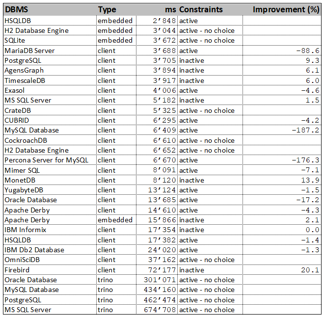

# DBSeeder - Release Notes


----

## Version 3.0.6

Release Date: dd.mm.2021

### System Requirements

- Operating system: any Java-enabled Linux, Mac or Windows variant
- Docker Desktop Community: 4.0.0 (e.g. from [Docker for Windows release notes](https://docs.docker.com/docker-for-windows/release-notes){:target="_blank"})
- Eclipse IDE: 2021.12 (e.g. from [Eclipse Download Page](https://www.eclipse.org/downloads){:target="_blank"})
- Gradle Build Tool: 7 (e.g. from [here](https://gradle.org/releases){:target="_blank"})
- Java Development Kit 17, (e.g. from [here](https://jdk.java.net/java-se-ri/17){:target="_blank"})
- an environment variable called `HOME_ECLIPSE` that points to the installation directory of Eclipse IDE, e.g.: `C:\Software\eclipse\java-2021-12\eclipse`

### New Features

- n/a

### Modified Features

- CockroachDB: DBMS v21.2.65
- CrateDB: DBMS 4.7.0
- Exasol: DBMS 7.1.6 / JDBC 7.1.4
- Firebird: DBMS v4.0.1 / JDBC 4.0.4.java11
- H2 database Engine: DBMS 2.1.210 / JDBC 2.1.210
- IBM Db2 Database: JDBC 11.5.7.0
- IBM Informix: DBMS 14.10.FC7W1DE / JDBC 4.50.7
- MariaDB Server: JDBC 3.0.3
- Mimer SQL: JDBC 3.42.3
- MonetDB: DBMS Jan2022-SP1 / JDBC 3.2.jre8
- MySQL Database: DBMS 8.0.28 / JDBC 8.0.28
- OmniSciDB: DBMS v5.10.2 / JDBC 5.10.0
- Oracle Database: JDBC 21.4.0.0.1
- Percona Server for MySQL: DBMS 8.0.26-17
- PostgreSQL: DBMS 14.2 / JDBC 42.3.3
- SQL Server: DBMS 2019-CU15-ubuntu-20.04
- TimescaleDB: DBMS 2.6.0-pg14
- trino: DBMS 368 / JDBC 368
- YugabyteDB: DBMS 2.12.1.0-b41

### Deleted Features

- n/a

### Open issues

- trino: (see [here](#issues_trino)
- VoltDB: (see [here](#issues_voltdb)

----

## Windows 10 Performance Snapshot

The finishing touch to the work on a new release is a test run with all databases under identical conditions on three different systems - Ubuntu 20.04 via VMware and WSL2, Windows 10. 
The measured time includes the total time required for the DDL effort (database, schema, user, 5 database tables) and the DML effort (insertion of 7011 rows). 
The hardware used includes an AMD Ryzen 9 5950X CPU with 128GB RAM. 
The tests run exclusively on the computer in each case. 
The detailed results can be found in the DBSeeder repository in the `resources/statistics` directory.

The following table shows the results of the Windows 10 run. 
If the database can run with both activated and deactivated constraints (foreign, primary and unique key), the table shows the better value and in the column `Improvement` the relative value to the worse run. 
For example, the MonetDB database is faster with inactive constraints by 11.9% compared to the run with activated constraints.



- `DBMS` - official DBMS name
- `Type` - client version, embedded version or via trino
- `ms` - total time of DDL and DML operations in milliseconds
- `Constraints` - DML operations with active or inactive constraints (foreign, primary and unique key)
- `Improvment` - improvement of total time if constraints are inactive 

----

## Detailed Open Issues

### <a name="issues_trino"></a> trino

- Issue: all connectors: absolutely unsatisfactory performance (see [here](https://github.com/trinodb/trino/issues/5681){:target="_blank"}).
    
### <a name="issues_voltdb"></a> VoltDB

- Issue: Java 16 not yet supported: `java.lang.NullPointerException: Cannot invoke "io.netty_voltpatches.NinjaKeySet.size()" because "this.m_ninjaSelectedKeys" is null`
```
    2021-09-02 03:39:41,112 [DatabaseSeeder.java] INFO  tickerSymbolAnyCase='voltdb'
    2021-09-02 03:39:41,112 [DatabaseSeeder.java] INFO  Start VoltDB
    2021-09-02 03:39:41,117 [AbstractDbmsSeeder.java] INFO  tickerSymbolIntern =voltdb
    2021-09-02 03:39:41,127 [AbstractJdbcSeeder.java] INFO  tickerSymbolExtern =voltdb
    java.lang.NullPointerException: Cannot invoke "io.netty_voltpatches.NinjaKeySet.size()" because "this.m_ninjaSelectedKeys" is null
        at org.voltcore.network.VoltNetwork.optimizedInvokeCallbacks(VoltNetwork.java:478)
        at org.voltcore.network.VoltNetwork.run(VoltNetwork.java:329)
        at java.base/java.lang.Thread.run(Thread.java:831)
    Sept. 02, 2021 3:39:41 AM org.voltcore.logging.VoltUtilLoggingLogger log
    SEVERE: NULL : Throwable: java.lang.NullPointerException: Cannot invoke "io.netty_voltpatches.NinjaKeySet.size()" because "this.m_ninjaSelectedKeys" is null
    java.lang.NullPointerException: Cannot invoke "io.netty_voltpatches.NinjaKeySet.size()" because "this.m_ninjaSelectedKeys" is null
        at org.voltcore.network.VoltNetwork.optimizedInvokeCallbacks(VoltNetwork.java:478)
        at org.voltcore.network.VoltNetwork.run(VoltNetwork.java:329)
        at java.base/java.lang.Thread.run(Thread.java:831)
    Sept. 02, 2021 3:39:41 AM org.voltcore.logging.VoltUtilLoggingLogger log
    SEVERE: NULL : Throwable: java.lang.NullPointerException: Cannot invoke "io.netty_voltpatches.NinjaKeySet.size()" because "this.m_ninjaSelectedKeys" is null
```
    
----------

